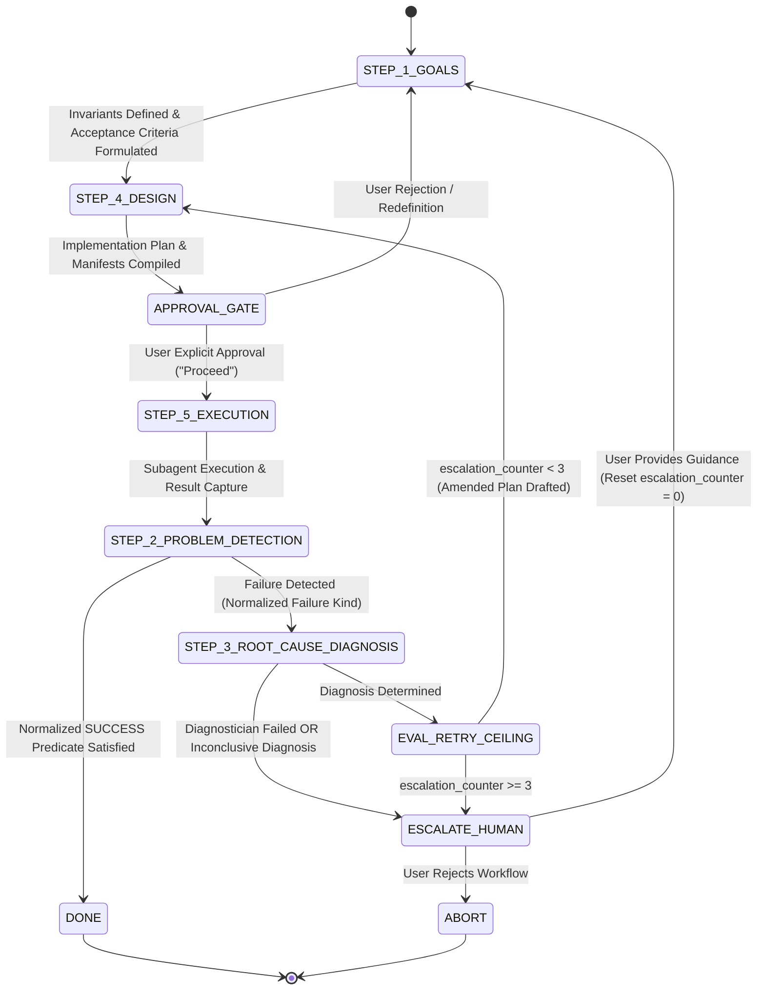

# Attention Guard Alignment with Ray Dalio's 5-Step Process Specification

**Date**: 2026-09-13
**Status**: Approved Specification
**Authors**: Antigravity & User

## 1. Context & Motivation

Antigravity's Attention Guard plugin acts as an architectural supervisor and gatekeeper across the platform. It enforces cognitive pacing, prevents context window saturation, restricts primary agent mutating actions, and ensures subagents execute deterministically.

While the current system enforces Phase 1 (Planning) versus Phase 2 (Execution) and prohibits error suppression via `rules/no-error-suppression.md`, a critical gap was identified when audited against **Ray Dalio's 5-Step Process**:

1. **Step 1: Have Clear Goals (Invariants & Falsifiable Criteria)**:
   `rules/AGENTS.md` mandates planning and risk evaluation in Phase 1, but lacks an enforceable requirement that every task specify **falsifiable acceptance criteria** (exact automated test commands and expected exit states) before subagents are dispatched.
2. **Step 2: Identify and Don't Tolerate Problems**:
   Current rules prohibit bare `pass` or silent failures, but subagents can still fall into shallow repair loops if an execution failure is not treated as a structural blocker.
3. **Step 3: Diagnose Root Causes (The Critical System Gap)**:
   When an execution subagent reports a failure, agents frequently confuse proximate causes (the failing assertion line or traceback) with root causes (underlying design flaws, invalid data contracts, or unhandled race conditions). The Escalation Protocol in `AGENTS.md` spawns a `pro` subagent but lacks a mandatory **Root Cause Diagnosis Gate**, allowing `pro` models to attempt speculative trial-and-error edits instead of diagnosing the underlying mechanism.
4. **Step 4: Design Plans (System as a Machine)**:
   Plans must model workflows as deterministic state machines or sequential checklists, bounded by an unbreachable human approval gate (`rules/explicit-approval.md`).
5. **Step 5: Push Through to Results (Execution Accountability & Observability)**:
   When executors fail, unstructured or missing error telemetry degrades orchestrator visibility. Executor failure payloads must follow a strict diagnostic schema.

### 1.1 Multi-Repository Boundaries and Ownership

To eliminate ambiguity across workspace environments, the implementation scope is partitioned across two distinct repositories:

- **Attention Guard Plugin Repository**:
  Canonical Working Directory: `/Users/thanghoang/github/antigravity-attention-guard-plugin`
  Installed Plugin Path: `/Users/thanghoang/.gemini/config/plugins/attention-guard`
  Ownership: Governs `rules/AGENTS.md`, `rules/EXECUTOR.md`, `rules/COORDINATOR.md`, schemas in `schemas/`, command validator in `scripts/command_validator.py`, deployment manager in `scripts/deploy_plugin.py`, hooks (`enforce-delegation.py`, `inject-rules.py`), and test suite `tests/test_dalio_conformance.py`.
- **AI Review Plugin Repository**:
  Canonical Working Directory: `/Users/thanghoang/github/ai-review-plugin`
  Installed Plugin Path: `/Users/thanghoang/.gemini/config/plugins/ai-review-plugin`
  Ownership: Governs the on-demand skills (`skills/spec-review/SKILL.md`, `skills/plan-review/SKILL.md`, `skills/code-review/SKILL.md`), CLI engine `scripts/peer_review.py`, and architectural specifications in `docs/superpowers/specs/`.

The canonical repositories are the primary sources of truth under version control. Deployment to installed plugin paths occurs via atomic staging and symlink pointer swapping.

---

## 2. Architecture & System Model

### 2.1 The 5-Step Agent Cognitive Closed Loop

The interaction lifecycle of Antigravity agents under Attention Guard is structured as a closed-loop system directly mapped to Dalio's 5 steps. Root-cause diagnosis is **strictly read-only**; no code mutations are permitted during escalation without re-entering plan refinement and human approval.



### 2.2 Four-Tier Delegation Topology & Concurrency Invariants

1. **Primary Agent (Non-Mutating Lifecycle Orchestrator)**:
   - Scope: Operates across both Phase 1 and Phase 2 as an orchestrator.
   - Constraints: Strictly forbidden from executing shell commands or modifying workspace code directly in any phase.
   - Responsibilities: Authors `implementation_plan.md`, compiles immutable `Acceptance Commands Manifest` and `Advisory Tasks Manifest`, dispatches subagents with unique `execution_attempt_id` envelopes, maintains retry counters across workflow lifecycles, performs authoritative schema and manifest validation, and gates all execution behind explicit human approval.
2. **Coordinator Subagent (Workstream Aggregator)**:
   - Model Tier: Inherits Primary Agent model tier or uses `pro`.
   - Constraints: Maximum recursion depth is 1 (cannot spawn another Coordinator).
   - Concurrency Policy (Decision 2A): Mutating worker subagents MUST execute sequentially with pre-dispatch disjoint file set validation. Parallel subagents are permitted ONLY for read-only / research tasks.
   - Fail-Fast Sibling Cancellation: If a worker fails, the Coordinator immediately cancels all running sibling subagents via `manage_subagents(action="kill")`. Cancelled siblings receive outcome `CANCELLED_BY_SIBLING_FAILURE` and do NOT increment retry counters or trigger independent diagnoses.
   - Lossless Aggregation Invariant: If ANY child worker reports `status: "failed"` or encounters a timeout, the Coordinator MUST NOT suppress or mask the failure. It must aggregate the complete worker telemetry into `subagent_results` and return `status: "failed"` with `failure_kind: "CHILD_FAILURE"`, listing all failed task IDs in `failed_child_tasks`. The only exception is if the failed child's `task_id` matches an entry in the approved `Advisory Tasks Manifest` with `advisory: true`.
3. **Diagnostician Subagent (Escalation Analyst)**:
   - Model Tier: `pro` (Maximum Reasoning).
   - Lifecycle: Activated exclusively during Step 3 (Escalation Protocol).
   - Constraints: **Strictly read-only.** Forbidden from modifying code, applying git commits, or executing state-altering commands.
   - Responsibilities: Investigates failure evidence, isolates proximate vs. root causes, evaluates competing hypotheses, and produces a structured diagnosis report with a proposed remediation strategy.
4. **Executor Subagent (Deterministic Worker)**:
   - Model Tier: `flash` (Mechanical Execution).
   - Constraints: Strictly forbidden from delegating tasks further. Max summary length is 1200 characters.
   - Responsibilities: Applies explicit diffs, executes specified acceptance commands, and captures structured outcomes.
   - Halting Invariant: If any command or assertion fails, the executor MUST stop immediately. Blind retries and symptom-patching are strictly forbidden.

### 2.3 Normalized Outcome & Failure Semantics

Outcomes are classified into eight normalized categories:

| Outcome Kind | Trigger Condition | Classification | Routing State |
| :--- | :--- | :--- | :--- |
| `SUCCESS` | Exit 0 AND payload valid AND failed tests == 0 AND all acceptance commands in manifest executed successfully | Completed | `DONE` or next plan task |
| `SHELL_NON_ZERO_EXIT` | Subprocess or command terminates with non-zero exit code | Failure | `STEP_3_ROOT_CAUSE_DIAGNOSIS` |
| `PAYLOAD_SCHEMA_VIOLATION` | Subagent JSON response fails draft-07 JSON Schema validation | Failure | `STEP_3_ROOT_CAUSE_DIAGNOSIS` |
| `COMMAND_POLICY_VIOLATION` | Command rejected by parser policy (unauthorized binary, path escape) | Failure | `STEP_3_ROOT_CAUSE_DIAGNOSIS` |
| `LIVENESS_TIMEOUT` | Background subagent exceeds 300s deadline without reporting | Failure | `STEP_3_ROOT_CAUSE_DIAGNOSIS` |
| `SYSTEM_SIGNAL` | Process terminated via `SIGTERM`, `SIGKILL`, or `SIGSEGV` | Failure | `STEP_3_ROOT_CAUSE_DIAGNOSIS` |
| `ASSERTION_FAILURE` | Command exits 0 but programmatic validation detects state breach | Failure | `STEP_3_ROOT_CAUSE_DIAGNOSIS` |
| `CANCELLED_BY_SIBLING_FAILURE` | Worker terminated early due to failure in a sibling worker | Cancelled | Ignored (No counter increment) |

Standard error output (`stderr`) alone does NOT constitute a failure if the process exits with code 0.

### 2.4 Command Provenance & Security Policy

To prevent prompt injection, shell breakout, and path traversal:

1. **Provenance Boundary**: Subagents may ONLY execute commands explicitly authored in the approved Phase 1 `Acceptance Commands Manifest`. Dynamically generated shell strings are strictly prohibited.
2. **Parser-Based Command Policy (`scripts/command_validator.py`)**:
   - Tokenization: The command line is parsed into an argument vector `argv` via `shlex.split()`.
   - Direct Execution Invariant: Commands must be executed directly as argument vectors via `subprocess.Popen(argv, shell=False)` in subagents. Raw shell constructs (`|`, `>`, `>>`, `<`, `&&`, `;`, `||`), command substitutions (`$(...)`, backticks), and `eval` are rejected with `COMMAND_POLICY_VIOLATION`.
   - Recursive Unwrapping: If `argv[0] == "rtk"`, the validator strips `rtk` and recursively validates `argv[1:]`.
   - Binary Whitelist: Allowed binaries are: `rtk`, `pytest`, `python3`, `git`, `rsync`, `diff`.
   - Executable-Specific Argument Policies:
     - `git`: Flags `-C`, `--git-dir`, `--work-tree`, and configuration/alias overrides (`-c`) are forbidden. Git hooks are disabled via `--no-verify`. Subcommands are restricted to `status`, `diff`, `log`, `add`, `commit`.
     - `rsync`: Flags `--rsh`, `-e`, and remote host targets (`user@host:`) are forbidden.
     - `python3`: Flags `-c` and `-m` with arbitrary modules are forbidden; only explicit Python script file targets located within the workspace or plugin directory are permitted.
     - `diff`: Only flag `-r` and local file/directory path comparisons are permitted.
   - Path Confinement & Deployment Capability:
     - Workspace Commands: All path arguments are resolved via `os.path.realpath()`. The resolved path must reside strictly within the workspace root: `os.path.commonpath([resolved_arg, workspace_root]) == workspace_root`.
     - Deployment Capability: For explicit synchronization commands (`scripts/deploy_plugin.py`), the source path must resolve to `/Users/thanghoang/github/antigravity-attention-guard-plugin` and the destination must resolve to `/Users/thanghoang/.gemini/config/plugins/attention-guard`.
3. **Sandbox Isolation**: All shell commands MUST execute within Antigravity's Standard Sandbox Mode (`BypassSandbox: false`). Deployment actions requiring write access to `~/.gemini/config/plugins/` constitute an explicit elevated deployment capability requiring user approval.

---

## 3. Component & Interface Contracts

The Primary Agent is the authoritative schema validator. Before accepting any subagent message, the Primary Agent validates the payload against draft-07 schemas using Python `jsonschema.validate(instance=payload, schema=schema, format_checker=jsonschema.FormatChecker())`. The Primary Agent strictly asserts that `payload["execution_attempt_id"] == dispatched_attempt_id`.

### 3.1 Immutable Manifest Draft-07 Schemas

During Phase 1, the Primary Agent compiles two manifests. Digests are calculated via RFC 8785 canonical JSON sorting: `hashlib.sha256(json.dumps(manifest, sort_keys=True, separators=(',', ':')).encode('utf-8')).hexdigest()`.

#### Acceptance Commands Manifest Schema (`schemas/acceptance-commands-manifest.json`)
```json
{
  "$schema": "http://json-schema.org/draft-07/schema#",
  "title": "AcceptanceCommandsManifest",
  "type": "object",
  "additionalProperties": false,
  "required": ["manifest_id", "manifest_digest", "commands"],
  "properties": {
    "manifest_id": { "type": "string", "format": "uuid" },
    "manifest_digest": { "type": "string", "pattern": "^[a-f0-9]{64}$" },
    "commands": {
      "type": "array",
      "minItems": 1,
      "items": {
        "type": "object",
        "additionalProperties": false,
        "required": ["command_id", "command", "result_kind", "required"],
        "properties": {
          "command_id": { "type": "string", "minLength": 1 },
          "command": { "type": "string", "minLength": 1 },
          "result_kind": { "type": "string", "enum": ["test_suite", "command_execution"] },
          "required": { "type": "boolean" }
        }
      }
    }
  }
}
```

#### Advisory Tasks Manifest Schema (`schemas/advisory-tasks-manifest.json`)
```json
{
  "$schema": "http://json-schema.org/draft-07/schema#",
  "title": "AdvisoryTasksManifest",
  "type": "object",
  "additionalProperties": false,
  "required": ["manifest_id", "manifest_digest", "advisory_tasks"],
  "properties": {
    "manifest_id": { "type": "string", "format": "uuid" },
    "manifest_digest": { "type": "string", "pattern": "^[a-f0-9]{64}$" },
    "advisory_tasks": {
      "type": "array",
      "items": {
        "type": "object",
        "additionalProperties": false,
        "required": ["task_id", "advisory"],
        "properties": {
          "task_id": { "type": "string", "minLength": 1 },
          "advisory": { "type": "boolean" }
        }
      }
    }
  }
}
```

#### Authoritative Coverage & Arithmetic Validation Algorithm
The Primary Agent evaluates executor `command_results` against the approved `Acceptance Commands Manifest`:
1. Collect all `manifest_commands` where `required == true`.
2. Assert that for each required command:
   - It appears exactly once in `command_results` with matching `command_id` and normalized `command_executed`.
   - `exit_code == 0`.
   - If `result_kind == "test_suite"`: `failed == 0`, `passed >= 0`, and `passed + failed == total`.
3. Assert that no unknown or unapproved `command_id` exists in `command_results`.
4. If any check fails, the payload is rejected as `ASSERTION_FAILURE`.

---

### 3.2 Contract 1: Diagnostician Subagent (`pro`)

#### JSON Schema (`schemas/diagnostician-payload.json`)
```json
{
  "$schema": "http://json-schema.org/draft-07/schema#",
  "title": "DiagnosticianPayload",
  "type": "object",
  "additionalProperties": false,
  "required": ["execution_attempt_id", "status", "summary"],
  "properties": {
    "execution_attempt_id": {
      "type": "string",
      "format": "uuid"
    },
    "status": {
      "type": "string",
      "enum": ["completed", "failed"]
    },
    "summary": {
      "type": "string",
      "minLength": 10,
      "maxLength": 1200
    },
    "error_details": {
      "type": "object",
      "additionalProperties": false,
      "required": ["failure_kind", "diagnostic_message"],
      "properties": {
        "failure_kind": {
          "type": "string",
          "enum": ["SHELL_NON_ZERO_EXIT", "COMMAND_POLICY_VIOLATION", "PAYLOAD_SCHEMA_VIOLATION", "LIVENESS_TIMEOUT", "SYSTEM_SIGNAL", "ASSERTION_FAILURE"]
        },
        "diagnostic_message": { "type": "string", "minLength": 5 }
      }
    },
    "diagnosis": {
      "type": "object",
      "additionalProperties": false,
      "required": ["root_cause_status", "proximate_cause", "evidence", "remediation_plan"],
      "properties": {
        "root_cause_status": {
          "type": "string",
          "enum": ["determined", "inconclusive"]
        },
        "proximate_cause": {
          "type": "string",
          "minLength": 10
        },
        "root_cause": {
          "type": "string",
          "minLength": 10
        },
        "evidence": {
          "type": "array",
          "minItems": 1,
          "items": {
            "type": "object",
            "oneOf": [
              {
                "additionalProperties": false,
                "required": ["evidence_kind", "source_file", "line_number", "observation"],
                "properties": {
                  "evidence_kind": { "const": "source_location" },
                  "source_file": { "type": "string", "minLength": 1 },
                  "line_number": { "type": "integer", "minimum": 1 },
                  "observation": { "type": "string", "minLength": 5 }
                }
              },
              {
                "additionalProperties": false,
                "required": ["evidence_kind", "command", "output_snippet", "observation"],
                "properties": {
                  "evidence_kind": { "const": "command_output" },
                  "command": { "type": "string", "minLength": 1 },
                  "output_snippet": { "type": "string", "minLength": 1 },
                  "observation": { "type": "string", "minLength": 5 }
                }
              },
              {
                "additionalProperties": false,
                "required": ["evidence_kind", "event_type", "timestamp", "observation"],
                "properties": {
                  "evidence_kind": { "const": "event_telemetry" },
                  "event_type": { "type": "string", "minLength": 1 },
                  "timestamp": { "type": "string", "format": "date-time" },
                  "observation": { "type": "string", "minLength": 5 }
                }
              },
              {
                "additionalProperties": false,
                "required": ["evidence_kind", "variable_or_resource", "observed_value", "observation"],
                "properties": {
                  "evidence_kind": { "const": "environment_state" },
                  "variable_or_resource": { "type": "string", "minLength": 1 },
                  "observed_value": { "type": "string", "minLength": 1 },
                  "observation": { "type": "string", "minLength": 5 }
                }
              }
            ]
          }
        },
        "competing_hypotheses": {
          "type": "array",
          "minItems": 1,
          "items": { "type": "string", "minLength": 10 }
        },
        "remediation_plan": {
          "type": "string",
          "minLength": 10
        }
      }
    }
  },
  "if": {
    "properties": { "status": { "const": "completed" } }
  },
  "then": {
    "required": ["diagnosis"],
    "properties": { "error_details": false },
    "if": {
      "properties": {
        "diagnosis": {
          "properties": { "root_cause_status": { "const": "determined" } }
        }
      }
    },
    "then": {
      "properties": {
        "diagnosis": {
          "required": ["root_cause"]
        }
      }
    },
    "else": {
      "properties": {
        "diagnosis": {
          "required": ["competing_hypotheses"]
        }
      }
    }
  },
  "else": {
    "required": ["error_details"],
    "properties": { "diagnosis": false }
  }
}
```

---

### 3.3 Contract 2: Executor Subagent (`flash`)

#### JSON Schema (`schemas/executor-payload.json`)
```json
{
  "$schema": "http://json-schema.org/draft-07/schema#",
  "title": "ExecutorPayload",
  "type": "object",
  "additionalProperties": false,
  "required": ["execution_attempt_id", "status", "summary"],
  "properties": {
    "execution_attempt_id": {
      "type": "string",
      "format": "uuid"
    },
    "status": {
      "type": "string",
      "enum": ["completed", "failed"]
    },
    "summary": {
      "type": "string",
      "minLength": 10,
      "maxLength": 1200
    },
    "files_modified": {
      "type": "array",
      "items": { "type": "string" }
    },
    "command_results": {
      "type": "array",
      "minItems": 1,
      "items": {
        "type": "object",
        "additionalProperties": false,
        "required": ["command_id", "command_executed", "result_kind", "exit_code"],
        "properties": {
          "command_id": { "type": "string", "minLength": 1 },
          "command_executed": { "type": "string", "minLength": 1 },
          "result_kind": { "type": "string", "enum": ["test_suite", "command_execution"] },
          "exit_code": { "type": "integer" },
          "passed": { "type": "integer", "minimum": 0 },
          "failed": { "type": "integer", "minimum": 0 },
          "total": { "type": "integer", "minimum": 0 }
        },
        "if": {
          "properties": { "result_kind": { "const": "test_suite" } }
        },
        "then": {
          "required": ["passed", "failed", "total"]
        }
      }
    },
    "error_details": {
      "type": "object",
      "oneOf": [
        {
          "additionalProperties": false,
          "required": ["failure_kind", "diagnostic_message", "failing_command", "exit_code", "stderr_summary"],
          "properties": {
            "failure_kind": { "const": "SHELL_NON_ZERO_EXIT" },
            "diagnostic_message": { "type": "string", "minLength": 5 },
            "failing_command": { "type": "string", "minLength": 1 },
            "exit_code": { "type": "integer", "not": { "const": 0 } },
            "stderr_summary": { "type": "string" }
          }
        },
        {
          "additionalProperties": false,
          "required": ["failure_kind", "diagnostic_message", "rejected_command", "policy_violation_reason"],
          "properties": {
            "failure_kind": { "const": "COMMAND_POLICY_VIOLATION" },
            "diagnostic_message": { "type": "string", "minLength": 5 },
            "rejected_command": { "type": "string", "minLength": 1 },
            "policy_violation_reason": { "type": "string", "minLength": 5 }
          }
        },
        {
          "additionalProperties": false,
          "required": ["failure_kind", "diagnostic_message", "schema_name", "validation_error"],
          "properties": {
            "failure_kind": { "const": "PAYLOAD_SCHEMA_VIOLATION" },
            "diagnostic_message": { "type": "string", "minLength": 5 },
            "schema_name": { "type": "string", "minLength": 1 },
            "validation_error": { "type": "string", "minLength": 5 }
          }
        },
        {
          "additionalProperties": false,
          "required": ["failure_kind", "diagnostic_message", "timeout_seconds", "timed_out_child_id"],
          "properties": {
            "failure_kind": { "const": "LIVENESS_TIMEOUT" },
            "diagnostic_message": { "type": "string", "minLength": 5 },
            "timeout_seconds": { "type": "integer", "minimum": 1 },
            "timed_out_child_id": { "type": "string", "minLength": 1 }
          }
        },
        {
          "additionalProperties": false,
          "required": ["failure_kind", "diagnostic_message", "signal_name", "exit_code"],
          "properties": {
            "failure_kind": { "const": "SYSTEM_SIGNAL" },
            "diagnostic_message": { "type": "string", "minLength": 5 },
            "signal_name": { "type": "string", "enum": ["SIGTERM", "SIGKILL", "SIGSEGV"] },
            "exit_code": { "type": "integer" }
          }
        },
        {
          "additionalProperties": false,
          "required": ["failure_kind", "diagnostic_message", "assertion_expression", "expected_state", "observed_state"],
          "properties": {
            "failure_kind": { "const": "ASSERTION_FAILURE" },
            "diagnostic_message": { "type": "string", "minLength": 5 },
            "assertion_expression": { "type": "string", "minLength": 1 },
            "expected_state": { "type": "string", "minLength": 1 },
            "observed_state": { "type": "string", "minLength": 1 }
          }
        }
      ]
    }
  },
  "if": {
    "properties": { "status": { "const": "completed" } }
  },
  "then": {
    "required": ["files_modified", "command_results"],
    "properties": {
      "error_details": false,
      "command_results": {
        "items": {
          "properties": {
            "exit_code": { "const": 0 },
            "failed": { "const": 0 }
          }
        }
      }
    }
  },
  "else": {
    "required": ["error_details"]
  }
}
```

---

### 3.4 Contract 3: Coordinator Subagent (`pro`)

#### JSON Schema (`schemas/coordinator-payload.json`)
```json
{
  "$schema": "http://json-schema.org/draft-07/schema#",
  "title": "CoordinatorPayload",
  "type": "object",
  "additionalProperties": false,
  "required": ["execution_attempt_id", "status", "summary", "subagent_results"],
  "properties": {
    "execution_attempt_id": {
      "type": "string",
      "format": "uuid"
    },
    "status": {
      "type": "string",
      "enum": ["completed", "failed"]
    },
    "summary": {
      "type": "string",
      "minLength": 10,
      "maxLength": 1200
    },
    "error_details": {
      "type": "object",
      "oneOf": [
        {
          "additionalProperties": false,
          "required": ["failure_kind", "diagnostic_message", "failed_child_tasks"],
          "properties": {
            "failure_kind": { "const": "CHILD_FAILURE" },
            "diagnostic_message": { "type": "string", "minLength": 5 },
            "failed_child_tasks": {
              "type": "array",
              "minItems": 1,
              "items": { "type": "string", "minLength": 1 }
            }
          }
        },
        {
          "additionalProperties": false,
          "required": ["failure_kind", "diagnostic_message", "failing_command", "exit_code", "stderr_summary"],
          "properties": {
            "failure_kind": { "const": "SHELL_NON_ZERO_EXIT" },
            "diagnostic_message": { "type": "string", "minLength": 5 },
            "failing_command": { "type": "string", "minLength": 1 },
            "exit_code": { "type": "integer", "not": { "const": 0 } },
            "stderr_summary": { "type": "string" }
          }
        },
        {
          "additionalProperties": false,
          "required": ["failure_kind", "diagnostic_message", "timeout_seconds", "timed_out_child_id"],
          "properties": {
            "failure_kind": { "const": "LIVENESS_TIMEOUT" },
            "diagnostic_message": { "type": "string", "minLength": 5 },
            "timeout_seconds": { "type": "integer", "minimum": 1 },
            "timed_out_child_id": { "type": "string", "minLength": 1 }
          }
        },
        {
          "additionalProperties": false,
          "required": ["failure_kind", "diagnostic_message", "schema_name", "validation_error"],
          "properties": {
            "failure_kind": { "const": "PAYLOAD_SCHEMA_VIOLATION" },
            "diagnostic_message": { "type": "string", "minLength": 5 },
            "schema_name": { "type": "string", "minLength": 1 },
            "validation_error": { "type": "string", "minLength": 5 }
          }
        }
      ]
    },
    "subagent_results": {
      "type": "array",
      "minItems": 1,
      "items": {
        "type": "object",
        "additionalProperties": false,
        "required": ["task_id", "worker_role", "status", "summary", "payload"],
        "properties": {
          "task_id": { "type": "string", "minLength": 1 },
          "worker_role": { "type": "string", "enum": ["executor", "diagnostician"] },
          "status": { "type": "string", "enum": ["completed", "failed", "cancelled"] },
          "advisory": { "type": "boolean" },
          "summary": { "type": "string", "minLength": 10 },
          "payload": {
            "type": "object"
          }
        }
      }
    }
  },
  "if": {
    "properties": { "status": { "const": "completed" } }
  },
  "then": {
    "properties": {
      "error_details": false,
      "subagent_results": {
        "items": {
          "not": {
            "properties": {
              "status": { "const": "failed" },
              "advisory": { "not": { "const": true } }
            },
            "required": ["status"]
          }
        }
      }
    }
  },
  "else": {
    "required": ["error_details"]
  }
}
```

---

## 4. Error Handling, Retry Limits & Failure Modes

### 4.1 State Machine Counter Contracts & Persistence

Loop counters are owned in memory by the Primary Agent:

```
               ┌───────────────────────────────────────────────────────────┐
               │                      WORKFLOW_INIT                        │
               │                  escalation_counter = 0                   │
               └─────────────────────────────┬─────────────────────────────┘
                                             │
                                             ▼
               ┌───────────────────────────────────────────────────────────┐
               │                     PHASE_2_EXECUTION                     │
               │             execution_attempt_id = uuid4()                │
               └──────────────┬─────────────────────────────┬──────────────┘
                              │                             │
                   Success (0)│                             │ Failure (!= 0)
                              ▼                             ▼
               ┌─────────────────────────────┐   ┌─────────────────────────┐
               │       DONE (SUCCESS)        │   │ STEP_3_DIAGNOSIS_GATE   │
               └─────────────────────────────┘   │ escalation_counter += 1 │
                                                 └────────────┬────────────┘
                                                              │
                               ┌──────────────────────────────┴──────────────────────────────┐
                               ▼                                                             ▼
               ┌──────────────────────────────┐                              ┌──────────────────────────────┐
               │ Diagnostician Failed OR      │                              │ Diagnosis Determined AND     │
               │ Inconclusive Diagnosis OR    │                              │ escalation_counter < 3       │
               │ escalation_counter >= 3      │                              └──────────────┬───────────────┘
               └──────────────┬───────────────┘                                             │
                              │                                                             ▼
                              │                                              ┌──────────────────────────────┐
                              │                                              │ STEP_4_DESIGN (Amended Plan) │
                              │                                              └──────────────┬───────────────┘
                              │                                                             │
                              │                                                             ▼
                              │                                              ┌──────────────────────────────┐
                              │                                              │ APPROVAL_GATE (Human Review) │
                              │                                              └──────────────┬───────────────┘
                              │                                                             │
                              │                                                             ▼
                              │                                              ┌──────────────────────────────┐
                              │                                              │ Retain escalation_counter -> │
                              │                                              │ Re-enter PHASE_2_EXECUTION   │
                              │                                              └──────────────────────────────┘
                              ▼
               ┌──────────────────────────────┐
               │        ESCALATE_HUMAN        │
               │ (Reset escalation_counter=0) │
               └──────────────────────────────┘
```

1. **Workflow Initialization**: `escalation_counter = 0` is initialized once at the beginning of the entire workflow.
2. **Persistence Across Plan Amendments**: When an execution failure occurs, `escalation_counter` is incremented by 1. When an amended plan is approved and execution re-enters Phase 2, `escalation_counter` is **retained without reset**.
3. **Idempotent Attempt Tracking**: Every dispatched execution cycle generates a unique `execution_attempt_id` (UUID). Subsequent failure events, timeouts, or coordinator aggregations sharing the same `execution_attempt_id` increment the counter only once.
4. **Advisory Task Validation**: When an executor or coordinator marks a child failure with `advisory: true`, the Primary Agent cross-references the task against the approved `Advisory Tasks Manifest`. If the task was not pre-approved as advisory, the exception is rejected as `ASSERTION_FAILURE`.
5. **Reset Invariant**: `escalation_counter` is reset to 0 ONLY when the human user provides guidance or resolves an escalated issue in `ESCALATE_HUMAN`.

### 4.2 Liveness Ownership & Bidirectional Fan-Out Map

Each spawner owns its direct children's liveness timers and maintains bidirectional maps:

```python
child_to_timer = {}  # child_conversation_id -> timer_task_id
timer_to_child = {}  # timer_task_id -> child_conversation_id
```

1. **Arming**: Whenever a child subagent is spawned, the spawner calls `schedule(DurationSeconds=300, TimerCondition="any")` and records:
   ```python
   timer_id = schedule_result["taskId"]
   child_to_timer[child_id] = timer_id
   timer_to_child[timer_id] = child_id
   ```
2. **Disarming on Message**: When a message arrives from `child_id`:
   ```python
   timer_id = child_to_timer.pop(child_id, None)
   if timer_id:
       timer_to_child.pop(timer_id, None)
       manage_task(Action="kill", TaskId=timer_id)
   ```
3. **Timeout Expiration & Race Handling**:
   - When timer notification `timer_id` triggers, the spawner retrieves `child_id = timer_to_child.pop(timer_id, None)`. If `child_id` is None, the notification is discarded as stale.
   - The spawner queries `manage_subagents(Action="list")` to inspect child status.
   - If the child is already completed/idle, the timer event is dismissed idempotently and the child message is processed.
   - If the child is still running, the spawner terminates it via `manage_subagents(Action="kill", ConversationIds=[child_id])`, emits a synthetic `LIVENESS_TIMEOUT` error payload, and triggers Step 3 diagnosis.

---

## 5. Behavioral Verification & Testing

### 5.1 Automated Behavioral Test Suite

In the Attention Guard repository (`/Users/thanghoang/github/antigravity-attention-guard-plugin`), the test suite `tests/test_dalio_conformance.py` validates contracts using `jsonschema.FormatChecker` and AST parsing:

1. **`test_manifest_schemas_and_rfc8785_digests`**:
   - Asserts that manifests validate against `schemas/acceptance-commands-manifest.json` and `schemas/advisory-tasks-manifest.json`.
   - Asserts that canonical RFC 8785 serialization produces identical SHA-256 digests across unordered JSON key variations.
2. **`test_acceptance_coverage_and_arithmetic_validator`**:
   - Asserts that omission of a required acceptance command raises `ASSERTION_FAILURE`.
   - Asserts that inconsistent test counts (`passed + failed != total`) raise `ASSERTION_FAILURE`.
3. **`test_diagnostician_schema_and_failure_details`**:
   - Asserts valid determined diagnosis passes.
   - Asserts that `status == "failed"` requires `error_details` and forbids `diagnosis`.
   - Asserts that invalid UUID format raises `ValidationError` under `FormatChecker`.
4. **`test_executor_schema_generic_commands`**:
   - Asserts that non-test commands with `result_kind: "command_execution"` validate with `exit_code: 0`.
   - Asserts that all 6 failure kinds validate with their required fields.
5. **`test_coordinator_lossless_aggregation_and_fail_fast`**:
   - Asserts that coordinator `subagent_results` losslessly wraps full child payloads.
   - Asserts that coordinator `CHILD_FAILURE` correctly references failed child task IDs.
6. **`test_command_validator_recursive_unwrapping_and_path_confinement`**:
   - Asserts that `rtk pytest ...` is recursively unwrapped and validated.
   - Asserts that path traversal (`../`), git `-C`, arbitrary python flags (`-c`), and unauthorized binaries are rejected with `COMMAND_POLICY_VIOLATION`.
7. **`test_counter_retention_across_amendments`**:
   - Verifies `escalation_counter` is retained across amended plan re-entry.
8. **`test_no_error_suppression_ast`**:
   - Parses Python scripts; asserts zero `ast.Pass` in `ast.ExceptHandler`.

### 5.2 Cross-Repository Verification Gate & Atomic Symlink Deployment

Verification is executed against canonical repositories, followed by atomic staged deployment:

1. **Attention Guard Conformance Verification**:
   ```bash
   rtk pytest /Users/thanghoang/github/antigravity-attention-guard-plugin/tests/test_dalio_conformance.py -v
   ```
   Invariant: Exit code 0, all named tests pass.

2. **AI Review Plugin Conformance Verification**:
   ```bash
   rtk pytest /Users/thanghoang/github/ai-review-plugin/tests/test_peer_review.py /Users/thanghoang/github/ai-review-plugin/tests/test_skills_conformance.py -v
   ```
   Invariant: Exit code 0, all unit and conformance tests pass.

3. **Atomic Plugin Deployment (`scripts/deploy_plugin.py`)**:
   Atomic deployment is executed via versioned directory creation and symlink pointer swapping:
   - Staging: Copies `rules/`, `schemas/`, `scripts/`, `hooks.json`, and `plugin.json` to `/Users/thanghoang/.gemini/config/plugins/attention-guard-release`.
   - Verification: Runs verification diff between canonical repo and release directory.
   - Atomic Symlink Swap:
     ```bash
     ln -sfn /Users/thanghoang/.gemini/config/plugins/attention-guard-release /Users/thanghoang/.gemini/config/plugins/attention-guard.tmp && \
     mv -f /Users/thanghoang/.gemini/config/plugins/attention-guard.tmp /Users/thanghoang/.gemini/config/plugins/attention-guard
     ```
   - Rollback Guard: If live sanity checks fail, the previous release pointer is restored immediately.
   - Post-Swap Verification:
     ```bash
     diff -r /Users/thanghoang/github/antigravity-attention-guard-plugin/rules/ /Users/thanghoang/.gemini/config/plugins/attention-guard/rules/
     diff -r /Users/thanghoang/github/antigravity-attention-guard-plugin/schemas/ /Users/thanghoang/.gemini/config/plugins/attention-guard/schemas/
     ```
     Invariant: Exit code 0, zero differences reported.
