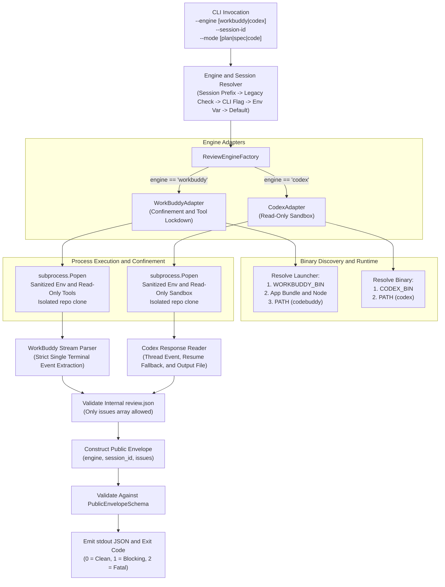

# WorkBuddy AI Review Engine Specification

- **Date**: 2026-09-13
- **Status**: Proposed
- **Authors**: AI Review Plugin Team and Antigravity
- **Target Component**: `scripts/peer_review.py`

---

## Context & Motivation

The `ai-review-plugin` provides an automated peer-review loop for software engineering artifacts (specifications, implementation plans, and source code diffs). Currently, `scripts/peer_review.py` exclusively targets the OpenAI Codex CLI (`codex`). While effective, Codex requires cloud API configuration and access tokens that may not be available across all local or enterprise development environments.

WorkBuddy AI is an enterprise AI assistant desktop application for macOS and Linux that packages a locally authenticated CLI (`codebuddy`, built on `@genie/agent-cli`). Headless verification on macOS confirms that WorkBuddy is installed at `/Applications/WorkBuddy AI.app/Contents/Resources/app.asar.unpacked/cli/bin/codebuddy`, authenticated via local application tokens, and capable of fast (approximately 2.9s) headless execution producing structured JSON adhering to JSON Schema definitions.

This specification defines the architectural design to incorporate WorkBuddy as the default AI review engine in `scripts/peer_review.py` while preserving backward compatibility with OpenAI Codex via a pluggable strategy adapter and explicit session-engine binding.

### Invariants & Architectural Alignment
1. **Stateless Orchestrator Paradigm (ADR 0002)**: `scripts/peer_review.py` remains strictly stateless. Retry counters, debate history, and multi-turn loops are maintained in-memory by the calling AI Agent or orchestrator, not in filesystem state.
2. **Deterministic Output Envelope**: Regardless of whether WorkBuddy or Codex is executed, the script writes and validates a uniform internal `review.json` schema and prints a public envelope containing `engine`, `session_id`, and `issues`, emitting standard process exit codes (0 for pass, 1 for blocking issues, 2 for fatal runtime or configuration failure).
3. **Zero Error Suppression**: Every process launch, serialization, schema validation, and timeout failure raises descriptive diagnostics to `sys.stderr` and exits with code 2. No silent failures, fallback masking, or empty catch blocks.
4. **Zero Placeholders**: Every contract, schema, code example, and test scenario is fully written out with concrete values. No TODO, TBD, WIP, or three consecutive dot tokens exist within this specification.

---

## Architecture & System Model



### 1. Engine Selection and Migration Precedence Policy

To prevent breaking existing automated pipelines, the review engine is resolved according to the following deterministic precedence rules:

1. **Explicit Session Engine Prefix**:
   - If `--session-id` contains an engine prefix (`workbuddy:<id>` or `codex:<id>`), the prefix authoritatively determines the engine.
   - If an explicit `--engine` flag is also supplied and contradicts the prefix, execution terminates immediately with exit code 2:
     `Fatal: Mismatched engine flag for session prefix.`
2. **Explicit Legacy Session ID (Unprefixed)**:
   - If `--session-id` is an unprefixed string (legacy format), and `--engine` is omitted: the engine authoritatively defaults to `codex`, ignoring `AI_REVIEW_ENGINE`. This preserves 100% backward compatibility for existing in-flight multi-turn sessions without requiring callers to pass `--engine codex`.
   - If `--session-id` is unprefixed and `--engine` is explicitly set, the explicit `--engine` is honored.
3. **Explicit CLI Flag**:
   - `--engine <workbuddy|codex>` passed on argv.
4. **Environment Variable Override**:
   - `AI_REVIEW_ENGINE` if set and non-empty.
5. **Default Engine**:
   - `"workbuddy"`.
   - **Migration Guard**: If no engine is specified, no session is being resumed, and WorkBuddy discovery fails while Codex is available on `$PATH`, the script terminates with exit code 2 and outputs an actionable advisory to `sys.stderr`:
     `Notice: Default engine 'workbuddy' not found on system. Pass '--engine codex' or install WorkBuddy AI.`

Any value outside `{"workbuddy", "codex"}` causes immediate termination with exit code 2:
`Fatal: Unsupported review engine. Supported engines: 'workbuddy', 'codex'.`

### 2. Pluggable Adapter Interface

```python
import abc

class ReviewEngineAdapter(abc.ABC):
    @abc.abstractmethod
    def resolve_binary(self) -> list[str]:
        raise NotImplementedError("Subclasses must implement resolve_binary")

    @abc.abstractmethod
    def build_command(
        self,
        launcher_cmd: list[str],
        repo_path: str,
        schema_path: str,
        review_file_path: str,
        prompt_text: str,
        session_id: str | None
    ) -> list[str]:
        raise NotImplementedError("Subclasses must implement build_command")

    @abc.abstractmethod
    def get_execution_environment(self) -> dict[str, str]:
        raise NotImplementedError("Subclasses must implement get_execution_environment")

    @abc.abstractmethod
    def extract_review_payload_and_session(
        self,
        stdout_path: str,
        stderr_path: str,
        review_file_path: str,
        prior_session_id: str | None
    ) -> tuple[dict, str]:
        raise NotImplementedError("Subclasses must implement extract_review_payload_and_session")
```

---

## Component & Interface Contracts

### 1. WorkBuddy Adapter Contract (`WorkBuddyAdapter`)

#### A. Binary and Launcher Discovery Contract
WorkBuddy CLI packages may exist as an application bundle JavaScript script or as a standalone executable on `$PATH`. Discovery proceeds as follows:

1. **Environment Variable**: Check `os.environ.get("WORKBUDDY_BIN")`. If set:
   - Verify path exists via `os.path.isfile(path)`. If non-existent, exit code 2:
     `Fatal: WORKBUDDY_BIN points to non-existent path.`
   - If executable via `os.access(path, os.X_OK)`: launcher is `[path]`.
   - If path ends with `.js`: resolve Node interpreter via `shutil.which("node")` or fallback paths `/opt/homebrew/bin/node` and `/usr/local/bin/node`. If Node is missing, exit code 2:
     `Fatal: Node.js runtime not found required to execute WORKBUDDY_BIN script.` Launcher is `[node_path, path]`.
   - Otherwise, if neither executable nor `.js`, exit code 2:
     `Fatal: WORKBUDDY_BIN is neither executable nor a recognized JavaScript bundle.`
2. **macOS Application Bundle**: Check:
   `/Applications/WorkBuddy AI.app/Contents/Resources/app.asar.unpacked/cli/bin/codebuddy`
   - If present: resolve Node interpreter. If Node is missing, exit code 2:
     `Fatal: Node.js runtime not found required to execute WorkBuddy application bundle.` Launcher is `[node_path, bundle_path]`.
3. **System PATH**: Check `shutil.which("codebuddy")`. If found:
   - Verify executable permissions `os.access(which_path, os.X_OK)`. If non-executable, exit code 2:
     `Fatal: Discovered codebuddy on PATH is not executable.`
   - Launcher is `[which_path]`.
4. **Failure**: If all checks fail, exit code 2:
   `Fatal: WorkBuddy CLI ('codebuddy') not found. Set WORKBUDDY_BIN or install WorkBuddy AI.`

#### B. Safe Input Transport & Context Delivery
Because WorkBuddy tools are locked down to prevent unauthorized host command execution, file contents cannot be assumed to be read via background tools. Instead, `scripts/peer_review.py` transports review inputs deterministically within the prompt structure:
1. **Target Artifact Embedding**: The entire content of `target.file` is read and embedded into the prompt enclosed in `<target_artifact path="...">` and `</target_artifact>` tags.
2. **Governing Specification Embedding**: If `--spec` is active, the entire content of `spec.file` is read and embedded enclosed in `<governing_specification path="...">` and `</governing_specification>` tags.
3. **Architectural Context Embedding**: All Markdown files in `docs/adr/` are read, concatenated with their relative paths, and embedded in `<architectural_decision_records>` tags.
4. **ADR Size-Guard & Context Budgeting**:
   - Total prompt character budget is capped at 500,000 characters (approx. 125,000 tokens).
   - Invariant: `target.file` and `spec.file` are primary review deliverables and are NEVER truncated.
   - If total embedded content (`target_content + spec_content + adr_content`) exceeds 500,000 characters:
     - The script reports a non-fatal warning to `sys.stderr`:
       `Warning: Embedded prompt context exceeds 500,000 characters. Truncating surrounding ADR context.`
     - Surrounding ADR context is budgeted: ADR files are loaded in reverse alphabetical order (newest first) up to the remaining character allowance (`500,000 - len(target_content) - len(spec_content)`), dropping older ADRs once the allowance is exhausted.

#### C. Threat Model, Security Boundary & Environment Sanitization
1. **Accepted Trust Boundary**: WorkBuddy operates under an application-layer defense-in-depth confinement model (tool lockdown, strict environment whitelisting, prompt boundary tagging, and working directory confinement) rather than an OS-level micro-VM or container jail.
2. **Environment Sanitization**: `get_execution_environment()` isolates secrets by whitelisting only:
   - `PATH`: System binary lookup path.
   - `HOME`: User home directory (required for WorkBuddy local authentication resolution).
   - `TMPDIR`: Isolated temporary directory created specifically for this run.
   - `CODEBUDDY_FORCE_HEADLESS_BUNDLE`: Set to `"1"`.
   - `USER`: Current username.
   All other ambient variables (including `OPENAI_API_KEY`, `AWS_SECRET_ACCESS_KEY`, `GITHUB_TOKEN`, and personal tokens) are deleted from the subprocess environment.
3. **Tool Lockdown & Confinement**:
   - CLI flags enforce tool disabling: `--tools ""` and `--disallowedTools "execute_command,write_to_file,replace_file_content"`.
   - Auto-confirmation `-y` is permitted only in conjunction with tool lockdown.
   - Working directory is set to `repo_copy` inside `tempfile.TemporaryDirectory()`.

#### D. Command Construction Contract
* **Session Start (`session_id is None`)**:
  ```bash
  [launcher_args] \
    -p \
    --output-format json \
    -y \
    --tools "" \
    --disallowedTools "execute_command,write_to_file,replace_file_content" \
    --json-schema <schema_path> \
    "<prompt_text>"
  ```
* **Session Resume (`session_id is not None`)**:
  ```bash
  [launcher_args] \
    -p \
    --output-format json \
    -y \
    --tools "" \
    --disallowedTools "execute_command,write_to_file,replace_file_content" \
    --json-schema <schema_path> \
    -r <unprefixed_session_id> \
    "<prompt_text>"
  ```

#### E. Strict Single-Event Stream Parser Contract
WorkBuddy outputs execution telemetry to `stdout`. The adapter reads `stdout_path` and processes the stream deterministically:
1. **Format Classification**:
   - **JSON Array**: If `stdout` starts with `[` and parses via `json.loads`, it represents a sequential list of event objects.
   - **Newline-Delimited JSON (NDJSON)**: If parsing the whole buffer as a single JSON array fails, split by newline and parse each non-empty line with `json.loads`.
   - **Single JSON Object**: If `stdout` starts with `{` and parses via `json.loads`, wrap into a single-item list.
2. **Strict Single Result Invariant**:
   - Iterate across all parsed events. Collect all objects where `event.get("type") == "result"`.
   - If zero result events exist: read truncated `stderr_path` (up to 2000 chars) and exit code 2:
     `Fatal: No result event found in WorkBuddy stdout stream.`
   - If more than one result event exists: reject the stream as non-deterministic and exit code 2:
     `Fatal: Multiple result events detected in WorkBuddy stdout stream. Expected exactly one.`
   - The single matching object is `terminal_event`.
3. **Subtype Verification**:
   - Inspect `terminal_event.get("subtype")`.
   - If `subtype != "success"`: extract error message from `terminal_event.get("error")` or `terminal_event.get("message")` or `"Unknown failure"`, emit to `sys.stderr`, and exit code 2:
     `Fatal: WorkBuddy returned error subtype.`
4. **Session Extraction & Formatting**:
   - Extract `raw_session_id = terminal_event.get("session_id")`.
   - If missing or empty, fall back to `prior_session_id` (stripping any existing `workbuddy:` prefix).
   - If still missing or empty, exit code 2:
     `Fatal: Could not determine session identifier from WorkBuddy execution.`
   - Format canonical session ID as `workbuddy:<raw_session_id>`.
5. **Payload Extraction & StructuredOutput Fallback**:
   - Inspect `terminal_event.get("result")`:
     - If non-empty string: deserialize with `json.loads(raw_result)`.
     - If dictionary: use directly.
   - **Fallback Extraction from `StructuredOutput` Tool Calls**:
     - If `result` is empty, null, or missing from `terminal_event`, inspect all parsed events in chronological order for a tool invocation named `StructuredOutput` (where `event.get("name") == "StructuredOutput"`, or `tool_call` object with function name `StructuredOutput`).
     - Extract tool call arguments: if stringified JSON, deserialize with `json.loads`.
   - **Data Envelope Unwrapping**:
     - If the extracted review payload is wrapped under a `"data"` key containing `"issues"` (`{"data": {"issues": [...]}}`), extract `review_dict["data"]` directly.
   - Write the finalized review dictionary to `review_file_path` (`work_dir/review.json`).

---

### 2. Codex Adapter Contract (`CodexAdapter`)

#### A. Binary Discovery Contract
1. Check `os.environ.get("CODEX_BIN")`. If set: verify file exists and is executable. If invalid, exit code 2:
   `Fatal: CODEX_BIN points to invalid path.`
2. Check `shutil.which("codex")`. If found, use it.
3. If unresolved, exit code 2:
   `Fatal: Codex CLI ('codex') not found. Set CODEX_BIN or install codex.`

#### B. Symmetric Security Boundary & Environment Sanitization
Codex receives the identical sanitized environment whitelist (`PATH`, `HOME`, `USER`, `TMPDIR`), with `OPENAI_API_KEY` retained if present in parent environment for cloud authentication. All other environment variables are stripped. Codex is invoked with `--sandbox read-only` to enforce read-only filesystem isolation.

#### C. Command Construction Contract
* **Session Start**:
  ```bash
  [codex_bin] exec -C <repo_copy> --sandbox read-only \
    --ignore-rules --ignore-user-config --skip-git-repo-check \
    --json --output-schema <schema_path> -o <review_file> "<prompt_text>"
  ```
* **Session Resume**:
  ```bash
  [codex_bin] exec -C <repo_copy> --sandbox read-only \
    --ignore-rules --ignore-user-config --skip-git-repo-check \
    --json resume <unprefixed_session_id> --output-schema <schema_path> -o <review_file> "<prompt_text>"
  ```

#### D. Session Extraction & Resume Fallback Contract
1. On session start: extract `raw_thread_id` from stdout event `{"type": "thread.started", "thread_id": "..."}`.
2. On session resume: if `thread.started` event is present, verify its `thread_id` matches `unprefixed_session_id`. If `thread.started` is omitted by Codex on resume, fall back to `unprefixed_session_id`.
3. If neither `thread.started` nor `prior_session_id` is available, exit code 2:
   `Fatal: Could not determine session identifier from Codex execution.`
4. Format canonical session ID as `codex:<raw_thread_id>`.
5. Review payload is read directly from `<review_file>` written by `codex -o`.

---

### 3. Schema Definitions

#### A. Internal Review Schema (`InternalReviewSchema`)
Used to constrain LLM generation via `--output-schema` and `--json-schema`:
```json
{
  "$schema": "http://json-schema.org/draft-07/schema#",
  "title": "InternalReviewPayload",
  "type": "object",
  "required": ["issues"],
  "additionalProperties": false,
  "properties": {
    "issues": {
      "type": "array",
      "items": {
        "type": "object",
        "required": ["severity", "description"],
        "additionalProperties": false,
        "properties": {
          "severity": { "type": "string", "enum": ["P0", "P1", "P2"] },
          "description": { "type": "string", "minLength": 1 }
        }
      }
    }
  }
}
```

#### B. Public Review Envelope Schema (`PublicReviewEnvelopeSchema`)
Validates the authoritative JSON object printed to `stdout` by `scripts/peer_review.py`:
```json
{
  "$schema": "http://json-schema.org/draft-07/schema#",
  "title": "PublicReviewEnvelope",
  "type": "object",
  "required": ["engine", "session_id", "issues"],
  "additionalProperties": false,
  "properties": {
    "engine": {
      "type": "string",
      "enum": ["workbuddy", "codex"]
    },
    "session_id": {
      "type": "string",
      "minLength": 1,
      "pattern": "^(workbuddy|codex):[a-zA-Z0-9_-]+$"
    },
    "issues": {
      "type": "array",
      "items": {
        "type": "object",
        "required": ["severity", "description"],
        "additionalProperties": false,
        "properties": {
          "severity": { "type": "string", "enum": ["P0", "P1", "P2"] },
          "description": { "type": "string", "minLength": 1 }
        }
      }
    }
  }
}
```

### 4. Issue Item Normalization Contract
When parsing and loading `review.json` into the public envelope, the adapter performs a deterministic normalization pass on every item in `issues`:
1. **Field Validation**:
   - `severity` MUST be present, a string, and one of `"P0"`, `"P1"`, or `"P2"`. Any missing or invalid severity value triggers an immediate fatal exit with code 2.
   - `description` MUST be present, a string, and non-empty after trimming whitespace.
2. **Metadata Folding**:
   - LLM engines frequently emit supplementary diagnostic fields (such as `file`, `line`, `location`, `title`, `rule_id`, or `category`) on issue items despite schema constraints.
   - If `file` is present and not already contained in `description`, prepend `"[file: <file>]"`.
   - If `line` is present and not already contained in `description`, prepend `"[line: <line>]"`.
   - If other arbitrary metadata keys are present, format them into the description text to ensure complete diagnostic context is retained without losing information.
3. **Strict Schema Conformance**:
   - The normalized issue item dictionary is constructed with *strictly* two keys: `{"severity": item["severity"], "description": folded_desc}`.
   - All extraneous keys are stripped, ensuring the resulting object strictly complies with `additionalProperties: false` in both `InternalReviewSchema` and `PublicReviewEnvelopeSchema`.

### 5. Diagnostic Redaction & Cleanup Contract
1. **Bounded Diagnostic Output**: All subprocess stderr logs and error output printed to `sys.stderr` are truncated to a maximum of 2,000 characters.
2. **Credential Redaction**: Before printing any stderr log or stdout fragment, common credential patterns (matching `bearer`, `token`, `secret`, `password`, or `key`) are sanitized and replaced with `[REDACTED]`.
3. **Secure Directory Permissions**: Temporary isolation directories are instantiated with restricted permissions `0o700` (`stat.S_IRWXU`).
4. **Deterministic Cleanup**: All temporary directories and files are cleaned up in a top-level `finally` block.

### 6. Exit Code Invariant
- **`0`**: Success. Zero issues with severity `P0` or `P1` exist in the issues list.
- **`1`**: Rejected. At least one issue with severity `P0` or `P1` exists in the issues list.
- **`2`**: Fatal Runtime Failure. Binary not found, invalid arguments, timeout, unhandled exception, or corrupt payload.

---

## Error Handling & Failure Modes

| Failure Mode | Detection Condition | Remediation & Exit Behavior |
| :--- | :--- | :--- |
| **Missing Engine Binary** | `resolve_binary()` fails all resolution checks | Print redacted notice to `stderr`, exit code 2. |
| **Invalid Engine Name** | `--engine` or `AI_REVIEW_ENGINE` not in `{'workbuddy', 'codex'}` | Print `Fatal: Unsupported review engine.` to `stderr`, exit code 2. |
| **Session Engine Mismatch** | `--session-id` prefix conflicts with explicit `--engine` flag | Print `Fatal: Mismatched engine flag for session prefix.` to `stderr`, exit code 2. |
| **Missing Node Interpreter** | WorkBuddy JS script detected but Node runtime absent | Print `Fatal: Node.js runtime not found.` to `stderr`, exit code 2. |
| **Process Timeout (>1800s)** | `communicate()` raises `TimeoutExpired` | Terminate process group with `SIGTERM`, wait 5s grace, then `SIGKILL`. Exit code 2. |
| **Process Non-Zero Exit** | Subprocess exits with code > 0 | Print bounded, redacted `stderr.log` to `sys.stderr`, exit code 2. |
| **Missing Result Event** | Zero events with `type == "result"` found in stream | Print `Fatal: No result event found in WorkBuddy stdout stream.` to `stderr`, exit code 2. |
| **Multiple Result Events** | More than one event with `type == "result"` found | Print `Fatal: Multiple result events detected in WorkBuddy stdout stream.` to `stderr`, exit code 2. |
| **WorkBuddy Error Subtype** | Result event has `subtype != "success"` | Print redacted error message from payload to `stderr`, exit code 2. |
| **Corrupted Review JSON** | `json.loads(raw_result)` fails | Print diagnostic error to `stderr`, exit code 2. |
| **Internal Schema Violation** | `review.json` fails `InternalReviewSchema` | Print `Fatal: Invalid review.json format.` to `stderr`, exit code 2. |
| **Public Envelope Violation** | Final envelope fails `PublicReviewEnvelopeSchema` | Print `Fatal: Public review envelope schema violation.` to `stderr`, exit code 2. |

---

## Verification & Testing

### 1. Automated Unit & Integration Test Suite (`tests/test_peer_review.py`)
Deterministic `pytest` test suite verifying every component contract:

1. `test_engine_resolution_default`: Verifies `workbuddy` is selected when no arguments or env vars are set.
2. `test_engine_resolution_cli_override`: Verifies `--engine codex` explicitly selects Codex.
3. `test_engine_resolution_env_override`: Verifies `AI_REVIEW_ENGINE=codex` controls selection when flag is omitted.
4. `test_engine_resolution_invalid_rejected`: Verifies passing `--engine unknown` exits with code 2.
5. `test_session_id_prefix_routing`: Verifies that `workbuddy:123` routes to WorkBuddy and `codex:456` routes to Codex.
6. `test_session_id_prefix_mismatch_fails`: Verifies `--session-id codex:123 --engine workbuddy` exits with code 2.
7. `test_legacy_session_id_unprefixed_defaults_to_codex`: Verifies unprefixed session ID authoritatively selects Codex.
8. `test_legacy_session_id_ignores_env_var`: Verifies unprefixed session ID selects Codex even when `AI_REVIEW_ENGINE=workbuddy`.
9. `test_migration_guard_advisory_on_missing_workbuddy`: Verifies actionable migration advisory if WorkBuddy is absent and Codex is present.
10. `test_workbuddy_binary_discovery_precedence`: Verifies search order: `WORKBUDDY_BIN` -> macOS App Bundle -> System `$PATH`.
11. `test_workbuddy_invalid_binary_override_error`: Verifies non-existent `WORKBUDDY_BIN` exits with code 2.
12. `test_workbuddy_missing_node_runtime_error`: Verifies actionable error when WorkBuddy JS script is found but `node` is absent.
13. `test_environment_sanitization_whitelist`: Verifies secret tokens are stripped from child environment for both engines.
14. `test_safe_prompt_transport_target_and_spec`: Verifies target file, spec file, and ADR files are embedded directly in prompt text.
15. `test_workbuddy_command_builder_initial`: Verifies command flags: `-p`, `--output-format json`, `-y`, `--tools ""`, `--disallowedTools`, `--json-schema`.
16. `test_workbuddy_command_builder_resume`: Verifies `-r <unprefixed_id>` is included on resumption.
17. `test_workbuddy_stream_parser_json_array`: Verifies parsing single terminal result event from JSON array stdout.
18. `test_workbuddy_stream_parser_ndjson`: Verifies parsing single terminal result from multi-line NDJSON stream.
19. `test_workbuddy_stream_parser_single_object`: Verifies parsing direct JSON object stdout.
20. `test_workbuddy_stream_parser_dict_valued_result`: Verifies unpacking when `result` is already a parsed dictionary.
21. `test_workbuddy_stream_parser_missing_result_event`: Verifies exit code 2 when stream contains zero result events.
22. `test_workbuddy_stream_parser_multiple_result_events_rejected`: Verifies exit code 2 when stream contains multiple result events.
23. `test_workbuddy_stream_parser_error_subtype`: Verifies that `subtype != "success"` raises fatal exit code 2.
24. `test_workbuddy_stream_parser_missing_session_id`: Verifies exit code 2 when neither payload nor prior session provides an ID.
25. `test_codex_backward_compatibility_command`: Verifies Codex adapter commands match pre-refactoring behavior.
26. `test_codex_resume_session_fallback`: Verifies Codex resumption uses `prior_session_id` when `thread.started` is omitted.
27. `test_diagnostic_redaction_and_truncation`: Verifies stderr diagnostics are bounded to 2000 chars and tokens are redacted.
28. `test_public_envelope_schema_validation`: Verifies that printed JSON satisfies `PublicReviewEnvelopeSchema`.

### 2. Live Smoke Verification
Execute an end-to-end headless run using the real WorkBuddy installation:
```bash
python3 scripts/peer_review.py \
  --engine workbuddy \
  --mode plan \
  --no-spec \
  --target ./README.md \
  --repo .
```
Verify exit code is `0` or `1`, standard output validates against `PublicReviewEnvelopeSchema`, and no error logs appear in `stderr`.
