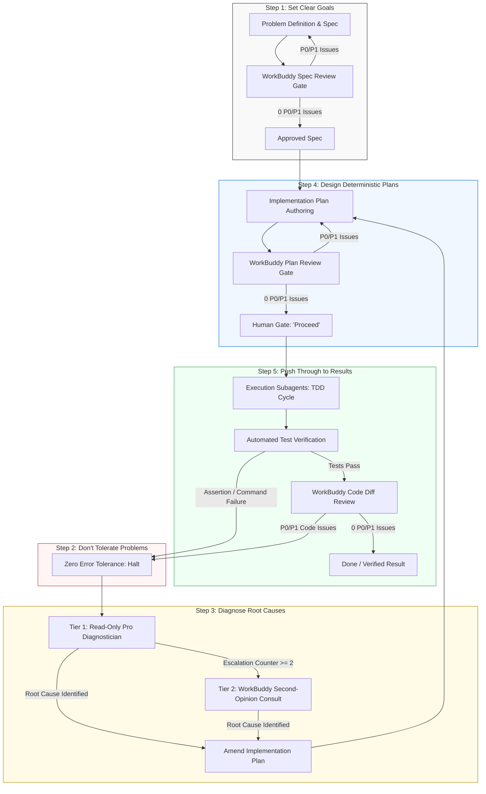

# Ray Dalio 5-Step Process & WorkBuddy Multi-Gate Coordination Audit

**Date:** 2026-09-15  
**Target Systems:**
1. `ai-review-plugin` (`/Users/thanghoang/github/ai-review-plugin`)
2. `antigravity-attention-guard-plugin` (`/Users/thanghoang/github/antigravity-attention-guard-plugin`)
3. Global Instructions Suite (`~/.gemini/config/rules/`)

**Status:** Completed Architectural Audit & Alignment Specification  

---

## 1. Executive Summary

This audit evaluates the architectural maturity, security boundaries, and operational alignment of the Antigravity developer environment against **Ray Dalio's 5-Step Process** (Clear Goals, Problem Intolerance, Root Cause Diagnosis, Deterministic Design, Execution Accountability).

The audit establishes a unified multi-agent architecture where:
- **`antigravity-attention-guard-plugin`** acts as the deterministic governance and enforcement engine (FSM lifecycle enforcement, execution gating, SQLite audit ledger, and Primary Agent confinement).
- **`ai-review-plugin`** (powered by WorkBuddy AI / DeepSeek 4.1 Flash via `codebuddy`) acts as the external adversarial reviewer and second-opinion diagnostician across the critical design and quality gates.
- **Global Instructions** provide cohesive, non-contradictory behavioral rules enforced through automated pre-tool hooks and post-tool validations.

---

## 2. Repository & System Inventory Baseline

### A. `ai-review-plugin` (`/Users/thanghoang/github/ai-review-plugin`)
- **Core Function**: Houses the multi-engine peer review script ([`scripts/peer_review.py`](file:///Users/thanghoang/github/ai-review-plugin/scripts/peer_review.py)) and review skills (`spec-review`, `plan-review`, `code-review`).
- **Engine Capabilities**:
  - Implements pluggable `ReviewEngineAdapter` strategy pattern.
  - Defaults to **WorkBuddy AI** (`codebuddy`) with **DeepSeek 4.1 Flash** (`deepseek-v4.1-flash`).
  - Preserves 100% backward compatibility for Codex (`--engine codex`, `AI_REVIEW_ENGINE=codex`, and legacy unprefixed session IDs).
  - Enforces strict tool lockdown via `--disallowedTools "Bash,Write,Edit,NotebookEdit"`.
  - Deterministic single-event stream parser with `StructuredOutput` tool-call fallback extraction and metadata normalization.
  - Bounded context transport with 500,000-character ADR size-guard budgeting.
- **Identified Deficiencies & Tech Debt**:
  1. **Redundant Nested Repository**: Contains a stale, unmanaged duplicate directory `attention-guard/` inside `ai-review-plugin/` that creates confusion, linting conflicts, and split-brain rule imports.
  2. **Skill Invocation Drift**: Review skills in `skills/` (e.g. `code-review/SKILL.md`) still mention manual two-stage subagent flows without leveraging the standardized `peer_review.py` CLI interface.

### B. `antigravity-attention-guard-plugin` (`/Users/thanghoang/github/antigravity-attention-guard-plugin`)
- **Core Function**: Enforces Ray Dalio's 5-Step Process and subagent delegation via Antigravity hooks.
- **Mechanisms**:
  - `PreToolUse` hooks (`scripts/enforce-delegation.py`, `scripts/command_validator.py`): Restricts Primary Agent from mutating code files or executing unwhitelisted shell binaries directly in Phase 1.
  - `PostToolUse` & Subagent Rule Injection (`scripts/inject-rules.py`, `scripts/record-tool-result.py`): Dynamically equips child subagents with role-specific constraints (`EXECUTOR.md`, `COORDINATOR.md`).
  - `Stop` hook (`scripts/attention-check.py`): Validates turn termination against an in-memory/SQLite FSM (`scripts/fsm.py`).
- **Identified Deficiencies & Tech Debt**:
  1. **Unenforced Review Gate**: Attention Guard's FSM permits transitioning from planning to execution as long as the user clicked "Proceed", without verifying that a clean `review.json` from WorkBuddy exists on disk.
  2. **Duplicate Local Installations**: The plugin exists as a standalone repo in `~/github/antigravity-attention-guard-plugin` while also having a separate local copy in `~/.gemini/config/plugins/attention-guard`, creating deployment drift.

### C. Global Instructions Suite (`~/.gemini/config/rules/`)
- **`rtk.md`**: Enforces `rtk` command prefixing and terminal output filtering to minimize LLM token bloat across all shell commands.
- **`no-error-suppression.md`**: Prohibits silent failure suppression, empty catch blocks, and `|| true` in shell scripts.
- **`explicit-approval.md`**: Prohibits Phase 2 execution transitions without unambiguous human consent ("Proceed").
- **`main-branch-protection.md`**: Enforces feature branch isolation and forbids direct modifications to main/master.
- **`reasoning-quality.md`**: Mandates information density, epistemic honesty, depth over breadth, and planning mode discipline.
- **Identified Deficiencies**:
  - Global rules operate in silos. They do not reference WorkBuddy's role or the multi-gate adversarial review loop.

---

## 3. Ray Dalio 5-Step Process: Deep Gap Analysis & Target Architecture



### Step 1: Set Clear Goals (Spec Review Gate)
- **Dalio Invariant**: You cannot achieve goals you have not clearly defined. Distinguish goals from desires; establish falsifiable acceptance criteria.
- **Gap**: Plans were frequently authored directly without an approved specification, or with specs that had never undergone multi-model adversarial testing.
- **Target Alignment**:
  1. Any non-trivial feature or architectural change requires a governing specification in `docs/superpowers/specs/`.
  2. Specification is subjected to WorkBuddy review:
     ```bash
     python3 scripts/peer_review.py --mode spec --target <spec_path> --repo .
     ```
  3. Spec is only considered approved when `issues` contains 0 P0/P1 findings.

### Step 2: Identify Problems and Don't Tolerate Them (Intolerance Gate)
- **Dalio Invariant**: Problems are the gaps between where you are and where you want to be. Never tolerate problems; never let minor issues slide; distinguish root problems from superficial noise.
- **Gap**: Review findings or test warnings were sometimes manually dismissed or deferred into unstructured backlogs without machine-enforced blocking.
- **Target Alignment**:
  1. `rules/no-error-suppression.md` strictly enforced: every exit code != 0 or broken assertion is a structural stop.
  2. In `scripts/peer_review.py`, exit code `1` is emitted if even a single P0 or P1 issue exists, blocking the pipeline.
  3. WorkBuddy's review verdicts are treated as binding gates, not optional suggestions.

### Step 3: Diagnose Problems to Get at Root Causes (Two-Tiered Diagnosis Gate)
- **Dalio Invariant**: Don't jump to solutions before you understand the root cause. Distinguish proximate causes from root causes.
- **Gap**: Previous recovery workflows sometimes entered trial-and-error loops when tests failed, applying speculative patches rather than diagnosing systemic flaws.
- **Target Alignment**:
  1. **Tier 1 (Internal Diagnostician)**: Primary Agent dispatches a `pro` subagent with read-only tools. Forbidden from editing code or running modifying commands. Output is structured `diagnostician-payload.json`.
  2. **Tier 2 (WorkBuddy External Second-Opinion)**: If diagnosis is ambiguous or `escalation_counter >= 2`, Antigravity invokes WorkBuddy AI with the failure traceback, test code, and diagnostic hypothesis.
  3. Root cause findings feed back into Step 4 to amend `implementation_plan.md` before any code is touched.

### Step 4: Design Deterministic Plans (Plan Gate & Human Gate)
- **Dalio Invariant**: Design plans before executing. Think of your problems as a set of outcomes produced by a machine. Determine who does what in what sequence.
- **Gap**: Human review was requested prematurely before multi-model peer review had eliminated architectural defects from the plan.
- **Target Alignment**:
  1. Plans must adhere to `superpowers:writing-plans` (2–5 minute bite-sized tasks, explicit test commands, zero placeholders).
  2. **WorkBuddy Plan Gate**: Before presenting the plan to the human, Antigravity executes:
     ```bash
     python3 scripts/peer_review.py --mode plan --target implementation_plan.md --repo . --spec <spec_path>
     ```
  3. **Human Gate**: Only after WorkBuddy passes the plan with 0 P0/P1 issues is the user prompted for explicit "Proceed" approval.
  4. **FSM Enforcement**: Attention Guard hooks verify the presence of a passing `review.json` before allowing execution tool calls.
  5. **Spec vs Plan Granularity Invariant**:
      - **Specification (`spec.md`)**: Defines the *WHAT* and the *RULES* (Architecture, Invariants, Interface Contracts, Schemas, Security Boundaries, Exit Codes). Zero code dumps or line-by-line implementation files.
      - **Implementation Plan (`plan.md`)**: Defines the *STEPS* and *VERIFICATION* (Bite-sized 2–5 min steps, exact file paths, exact automated test commands). Strictly forbids copy-pasting massive code blocks or duplicating whole files into markdown (prevents writing code twice, token waste, and documentation drift). Code snippets in plans are strictly limited to concise interface diffs or non-obvious contracts.

### Step 5: Push Through to Results (Execution Accountability)
- **Dalio Invariant**: Great planners who don't execute go nowhere. Push through to results with clear metrics and execution accountability.
- **Gap**: Execution tasks sometimes lacked rigid step-by-step verification commands or permitted subagents to deviate from the planned diffs.
- **Target Alignment**:
  1. Phase 2 execution strictly handled by `flash` subagents with single-task scopes.
  2. Child subagents return strict, schema-validated JSON payloads (`schemas/executor-payload.json`) containing immutable `execution_attempt_id` values.
  3. Final code diff is evaluated with `peer_review.py --mode code` before completion claims are accepted.

---

## 4. WorkBuddy AI Coordination Architecture

| Dimension | Specification & Contract |
|---|---|
| **Engine Identity** | WorkBuddy AI CLI (`codebuddy`) |
| **Model Default** | `deepseek-v4.1-flash` (with alias normalization for fast/flash models) |
| **Tool Confinement** | `--disallowedTools "Bash,Write,Edit,NotebookEdit"` (strictly prevents shell and file mutation while permitting `StructuredOutput` and safe context reads) |
| **Environment Boundary** | Sanitized whitelist: `PATH`, `HOME`, `USER`, `TMPDIR`, `CODEBUDDY_FORCE_HEADLESS_BUNDLE=1` |
| **Invocation Pattern** | Primary Agent dispatches a lightweight `flash` subagent to invoke `scripts/peer_review.py`, preserving Primary Agent confinement |
| **Debate & Rebuttal** | Multi-turn debate uses WorkBuddy's native session resume (`-r <session_id>`), capped at 3 rounds before human escalation |
| **Audit Ledger** | Every review invocation, debate turn, and verdict is recorded in Attention Guard's SQLite database (`~/.gemini/antigravity/attention_guard.db`) |

---

## 5. Repository Cleanup & Symlink Topology

```
~/github/
├── ai-review-plugin/                     <-- Core Review Engine & Skills
│   ├── scripts/peer_review.py            <-- WorkBuddy/Codex Strategy Adapter
│   ├── skills/{spec,plan,code}-review/   <-- Review Skills
│   └── tests/test_peer_review.py         <-- 43 Unit/Integration Tests
│
└── antigravity-attention-guard-plugin/   <-- Core Governance & Enforcement
    ├── hooks.json                        <-- PreToolUse, PostToolUse, Stop Hooks
    ├── scripts/{fsm,ledger,enforce}.py   <-- Deterministic Guardrail Engine
    └── rules/{AGENTS,COORDINATOR,EXEC}.md<-- Dalio Lifecycle Rules

~/.gemini/config/plugins/
├── ai-review-plugin -> ~/github/ai-review-plugin
└── attention-guard  -> ~/github/antigravity-attention-guard-plugin
```

**Actions Required**:
1. Remove stale nested directory: `rm -rf /Users/thanghoang/github/ai-review-plugin/attention-guard`.
2. Ensure clean symlinks from `~/.gemini/config/plugins/` to both source repositories in `~/github/`.
3. Verify test suites in both repositories pass independently without mutual directory dependencies.

---

## 6. Implementation Roadmap & Milestones

1. **Milestone 1: Repository Topology & Redundancy Removal**
   - Delete stale nested `attention-guard` inside `ai-review-plugin`.
   - Re-link `~/.gemini/config/plugins/` to source repositories.
   - Run tests to confirm zero path pollution.

2. **Milestone 2: Attention Guard FSM Review-Gate Integration**
   - Enhance `fsm.py` and `scripts/enforce-delegation.py` to check for clean `review.json` before allowing Phase 2 execution tools.
   - Add unit tests in `antigravity-attention-guard-plugin` verifying the gate blocks execution if `review.json` is missing or contains P0/P1 issues.

3. **Milestone 3: Review Skill Harmonization**
   - Update `skills/spec-review/SKILL.md`, `skills/plan-review/SKILL.md`, and `skills/code-review/SKILL.md` to invoke `scripts/peer_review.py` via delegated `flash` subagents.

4. **Milestone 4: Two-Tiered Root Cause Diagnosis Integration**
   - Update `attention-guard/rules/AGENTS.md` Step 3 to formalize WorkBuddy second-opinion consults when `escalation_counter >= 2`.
   - Author diagnostic probe integration in `scripts/peer_review.py`.

5. **Milestone 5: Full Multi-Gate Live Verification**
   - Execute an end-to-end live verification of a sample task traversing all 5 steps with live WorkBuddy AI reviews.
