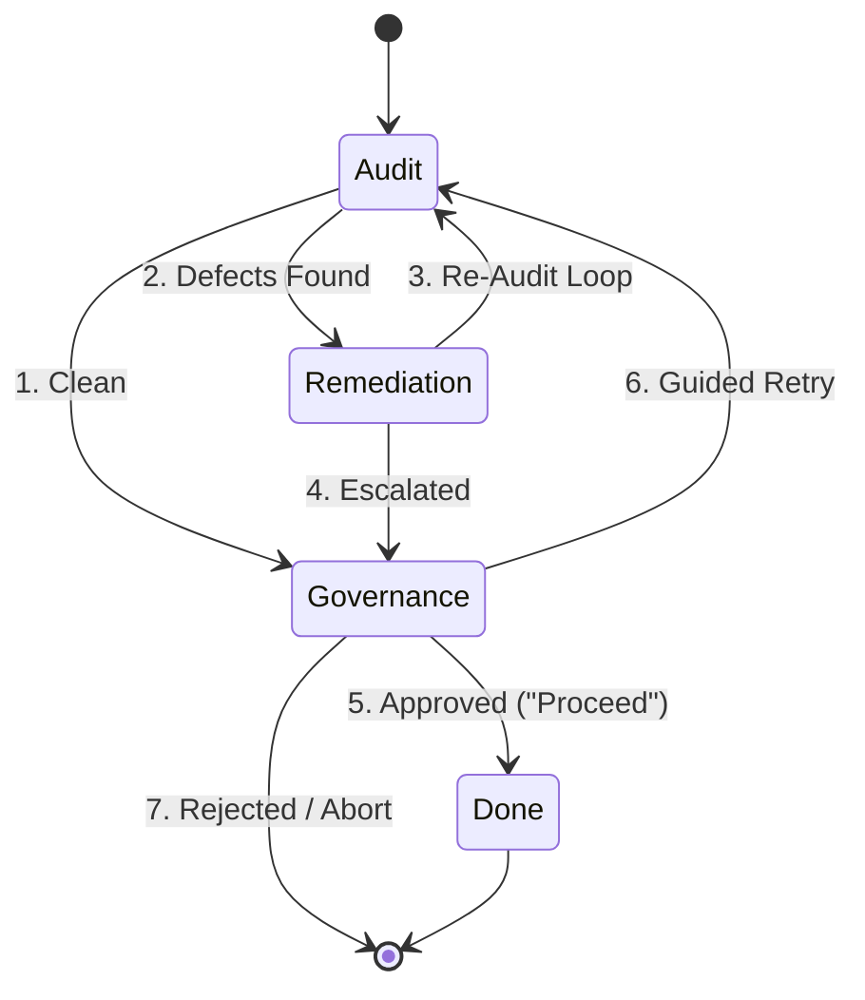
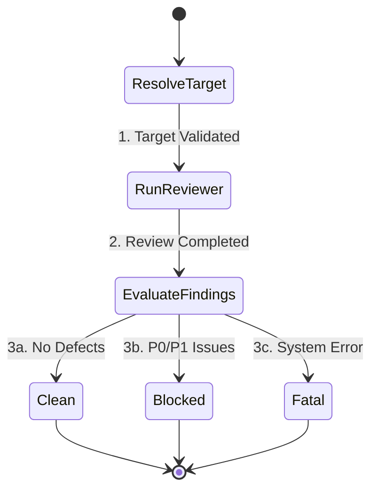
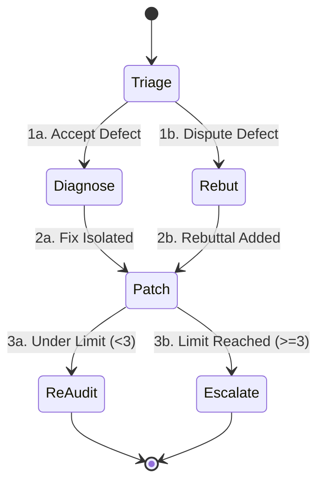
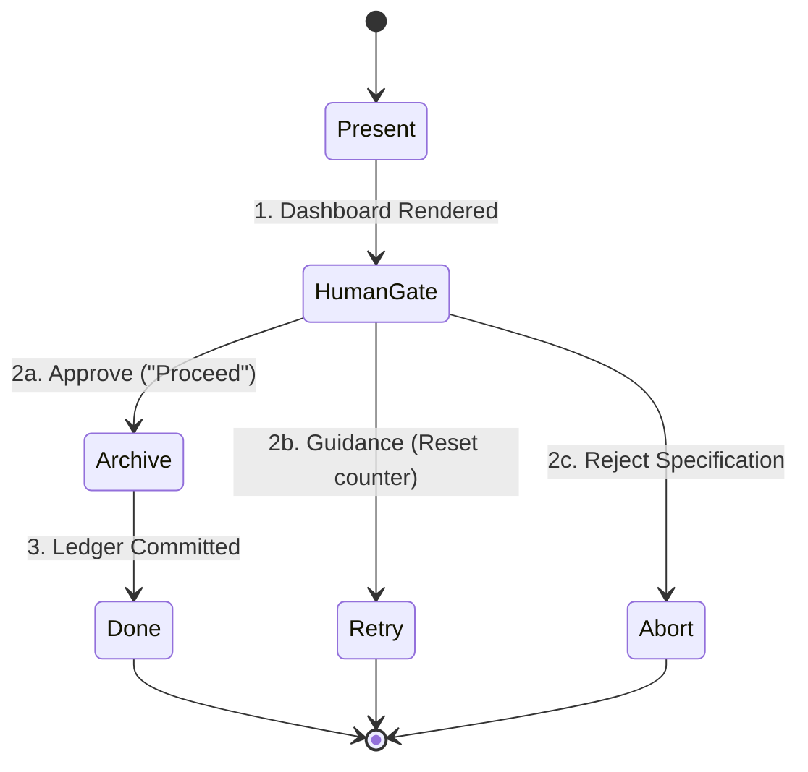

# Design: Modular Review Architecture Refactor

**Feature ID:** `2026-09-16-modular-review-flows`  
**Governing Specification:** [`spec.md`](./spec.md)  
**Status:** Approved

---

## 1. High-Level Lifecycle Architecture

### Transition Reference Table:
| Transition | Name | Description |
| :--- | :--- | :--- |
| **`1`** | Clean | Zero P0/P1 issues detected in audit pass. Routes straight to Governance. |
| **`2`** | Defects Found | At least one P0 or P1 issue detected. Triggers Remediation. |
| **`3`** | Re-Audit Loop | Document amended; re-audits via `--prior-review` (`escalation_counter < 3`). |
| **`4`** | Escalated | `escalation_counter >= 3` or diagnosis inconclusive. Routes to Human Gate. |
| **`5`** | Approved | Human approves ("Proceed"). Commits audit ledger and transitions to Phase 2. |
| **`6`** | Guided Retry | Human provides guidance or override. Resets `escalation_counter = 0`. |
| **`7`** | Rejected | Human rejects specification or design. Workflow aborted. |

---

## 2. Separated Stage State Machines

### 2.1 Audit Stage

### 2.2 Remediation Stage

### 2.3 Governance Stage

