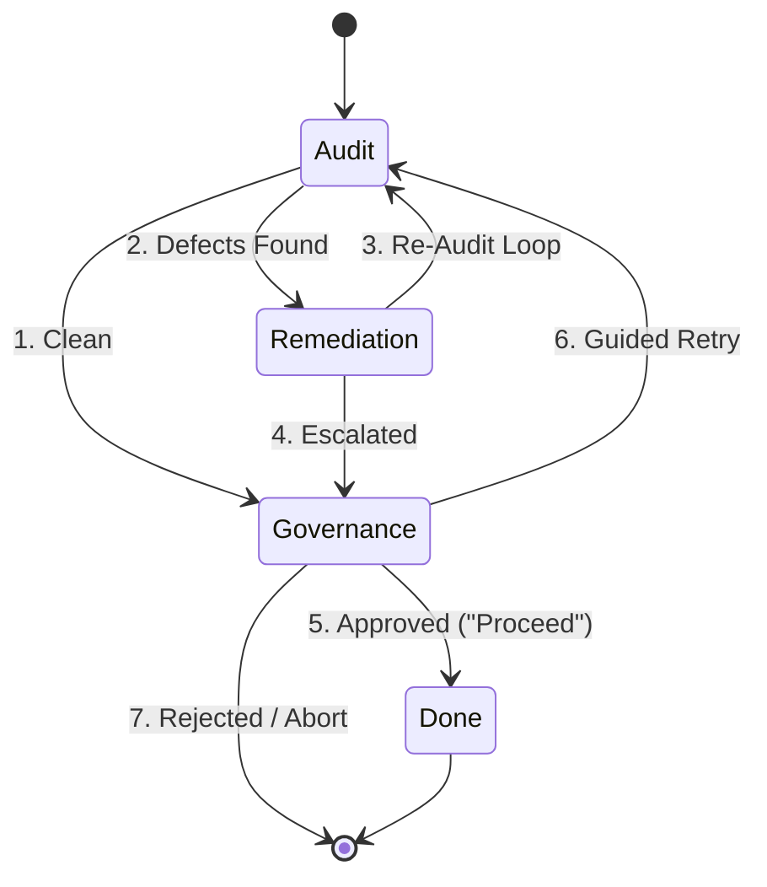

# Specification: Modular Review Architecture Refactor

**Feature ID:** `2026-09-16-modular-review-flows`  
**Requirement Range:** `REQ-021` to `REQ-025`  
**Status:** Approved by Human Gate  
**Governing Standard:** [`rules/spec-standard.md`](file:///Users/thanghoang/github/ai-review-plugin/rules/spec-standard.md)

---

## 1. Problem Statement & Motivation
The previous review architecture documented in `docs/superpowers/specs/2026-09-13-two-stage-spec-and-plan-review-design.md` suffered from state explosion:
1. **13 Monolithic States & 25+ Transitions:** Attempted to model target discovery, peer review execution, local debates, self-reviews, diagnostic fixes, and human approval in a single massive state machine.
2. **Tripled Counters:** Maintained `attempt_counter`, `debate_counter`, and `self_review_counter` independently, creating confusing combinatoric exits.
3. **Unnumbered, Cluttered Diagrams:** Unreadable condition guards on arrows obscured the sequential flow of work.
4. **Conflict with Dalio 5-Step Process:** The local `DIAGNOSE -> FIX -> SELF_REVIEW` loop fought against the global `AGENTS.md` root-cause escalation protocol (Tier 1 Diagnostician / Tier 2 External Second-Opinion / Human Gate).

---

## 2. High-Level Lifecycle Architecture

### Transition Reference Table:
| Transition | Name | Condition / Action |
| :--- | :--- | :--- |
| **`1`** | Clean | Zero P0/P1 issues detected in audit pass. Routes straight to Governance. |
| **`2`** | Defects Found | At least one P0 or P1 issue detected. Triggers Remediation. |
| **`3`** | Re-Audit Loop | Document amended; re-audits via `--prior-review` (`escalation_counter < 3`). |
| **`4`** | Escalated | `escalation_counter >= 3` or diagnosis inconclusive. Routes to Human Gate. |
| **`5`** | Approved | Human approves ("Proceed"). Commits audit ledger and transitions to Phase 2. |
| **`6`** | Guided Retry | Human provides guidance or override. Resets `escalation_counter = 0`. |
| **`7`** | Rejected | Human rejects specification or design. Workflow aborted. |

---

## 3. Normative Requirements

### REQ-021: Pure Semantic Lifecycle Decomposition
The review architecture SHALL decompose the review workflow into three distinct, decoupled stages using pure semantic domain terminology without numeric stage prefixes:
1. **Audit (Read-Only):** Discovers target file (`spec.md` or `design.md`), checks preconditions, runs `peer_review.py` (with optional `--prior-review`), validates JSON schema, and emits a normalized verdict (`CLEAN`, `BLOCKED`, or `FATAL`).
2. **Remediation:** Consumes `BLOCKED` verdicts, classifies issues, conducts Dalio Step 3 Root Cause Diagnosis, applies document amendments, and determines next action (`READY_FOR_RE_AUDIT` or `ESCALATE_TO_HUMAN`).
3. **Governance:** Formally pauses execution for human review ("Proceed" / Guidance / Abort), archives passing or escalated review JSON into `reviews/<mode>-v<N>.json`, and updates `docs/superpowers/specs/INDEX.md`.

### REQ-022: Orchestrated Pipeline Coupling
The Primary Agent SHALL orchestrate the stages as a linear pipeline with bounded remediation loops:
1. **Audit** automatically transitions to **Remediation** (Transition 2) when `BLOCKED` (P0/P1 issues present).
2. **Remediation** transitions back to **Audit** (Transition 3) via `--prior-review` to verify that previously flagged issues were legitimately resolved without regressions.
3. Remediation loops SHALL be strictly bounded by `escalation_counter < 3`. If `escalation_counter >= 3` or diagnosis is inconclusive, **Remediation** SHALL immediately halt and transition to **Governance** (Transition 4).

### REQ-023: Stateless Technical Rebuttal Protocol
Disagreements between the agent and reviewer findings SHALL NOT spawn dedicated debate subagents or multi-turn debate loops:
1. If the agent legitimately disputes a reviewer finding, it SHALL append an evidence-backed technical rationale to the prior review context.
2. The rebuttal SHALL be injected into the re-audit pass via the stateless `--prior-review` flag.
3. If the reviewer maintains the defect after reviewing the rebuttal, the dispute SHALL be routed directly to **Governance** for human arbitration.

### REQ-024: Semantic Review File Archival & Central Indexing
Review persistence SHALL follow a deterministic naming and registry protocol:
1. Review files SHALL be archived in the feature package directory under `docs/superpowers/specs/<feature-id>/reviews/<mode>-v<N>.json` (e.g. `spec-v1.json`, `spec-v2.json`, `design-v1.json`).
2. The central catalog at `docs/superpowers/specs/INDEX.md` SHALL record the feature's latest status, date, and link to the latest review artifact.

### REQ-025: In-Place Skill Streamlining & Numbered Transition Conformance
The user-facing entry points `skills/spec-review/SKILL.md` and `skills/design-review/SKILL.md` SHALL be refactored in-place:
1. Their procedural markdown SHALL implement the pure semantic 3-stage pipeline (**Audit**, **Remediation**, **Governance**).
2. Embedded Mermaid state diagrams SHALL use clean, numbered transitions without inline condition bloat.
3. All obsolete states (`INIT`, `DISCOVER`, `SPEC_GATE`, `SELF_REVIEW`, `DEBATE`, `FIX`, `EVALUATE`) and multi-counter logic SHALL be removed.
4. Automated conformance tests SHALL verify the semantic architecture across all skills.
