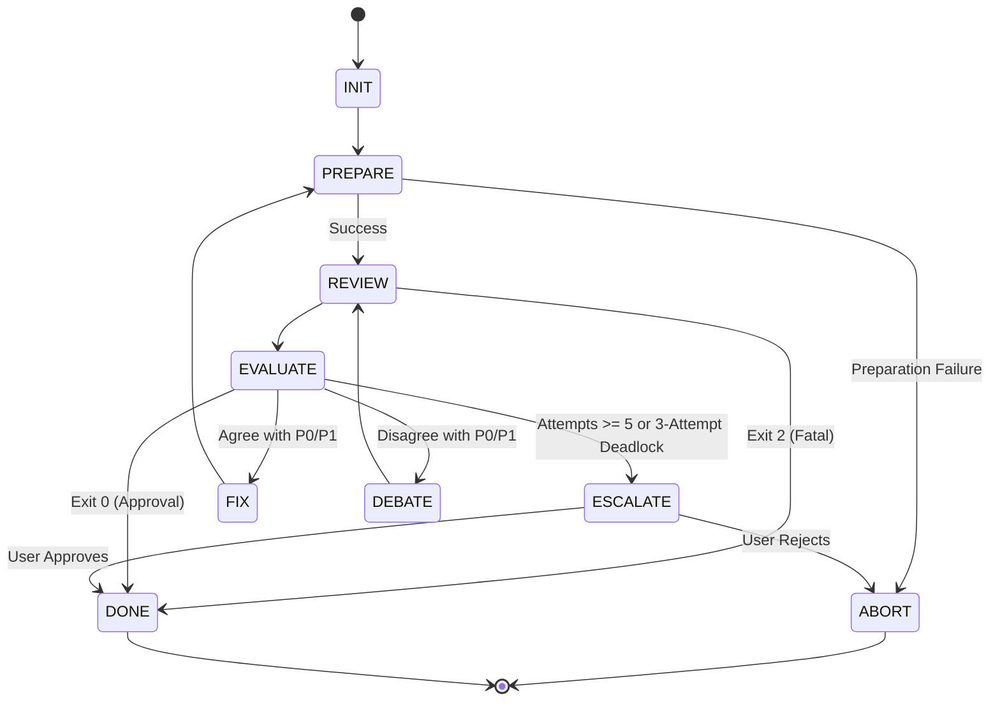

# Code Review Protocol

### State: INIT
**Action:**
- Initialize `attempt_counter = 0` and `session_id = null`.

**Transitions:**
- -> Transition to `PREPARE`

### State: ABORT
**Action:**
- Clean up temporary artifacts (`$REVIEW_TARGET`, `$GIT_INDEX_FILE`).
- Stop execution.

**Transitions:**
- -> [Terminal State]

### State: PREPARE
**Action:**
- Identify the explicit list of files you modified or created for this task.
- Generate a comprehensive diff using a temporary index to preserve the user's working state:
  `mkdir -p .tribunal`
  `REVIEW_TARGET=$(mktemp "$(pwd)/.tribunal/review_XXXXXX.diff")`
  `export GIT_INDEX_FILE=$(mktemp -u)`
  `git read-tree HEAD || true`
  `git add <FILES>`
  `if git rev-parse HEAD >/dev/null 2>&1; then git diff --cached HEAD > "$REVIEW_TARGET"; else git diff --cached 4b825dc642cb6eb9a060e54bf8d69288fbee4904 > "$REVIEW_TARGET"; fi`
  `if ! test -s "$REVIEW_TARGET"; then rm -f "$REVIEW_TARGET" "$GIT_INDEX_FILE"; exit 1; fi`
  `rm "$GIT_INDEX_FILE"`
  `unset GIT_INDEX_FILE`

**Transitions:**
- On failure (e.g. empty diff, command failure) -> Transition to `ABORT`
- On success -> Transition to `REVIEW`

### State: REVIEW
**Action:**
- Increment your internal attempt counter.
- Run the peer review script:
  - For Attempt 1:
    `python3 ~/.gemini/config/plugins/ai-review-plugin/scripts/peer_review.py --mode code --target "<REVIEW_TARGET>" --repo .`
  - For Attempts 2+: Substitute `<SESSION_ID>` literally using the stored ID.
    `python3 ~/.gemini/config/plugins/ai-review-plugin/scripts/peer_review.py --mode code --target "<REVIEW_TARGET>" --repo . --session-id "<SESSION_ID>" [--message "<MESSAGE>"]`
- Check for Exit 2 (Fatal) before attempting to parse the JSON output.
- Parse the JSON output, extract and save the `session_id` for subsequent attempts.
- Save the full JSON to `docs/adr/<timestamp>_review_rev<N>.json`.

**Transitions:**
- If Exit 2 (Fatal) -> Transition to `DONE`
- Else -> Transition to `EVALUATE`

### State: EVALUATE
**Action:**
- Analyze the JSON output. 
- P2 issues are non-blocking advisory feedback.
- Evaluate guards in priority order.

**Transitions:**
- Priority 1: If Exit 0 (Approved) -> Transition to `DONE`
- Priority 2: If Exit 1 (Rejected) and attempt counter >= 5 -> Transition to `ESCALATE`
- Priority 2: If Exit 1 (Rejected) and Codex has refused your rebuttal 3 times on the same issue -> Transition to `ESCALATE`
- Priority 3: If Exit 1 (Rejected) and you agree with the P0/P1 issues -> Transition to `FIX`
- Priority 3: If Exit 1 (Rejected) and you disagree (e.g. out of scope, incorrect) -> Transition to `DEBATE`

### State: FIX
**Action:**
- Modify the codebase to address the P0/P1 issues.
- Clean up the old `REVIEW_TARGET` `mktemp` diff file to avoid orphaned files.

**Transitions:**
- -> Transition to `PREPARE` (to regenerate the `.diff` file and start over)

### State: DEBATE
**Action:**
- Do not change the code. Formulate a technical rebuttal explaining why the issue is invalid or out of scope.

**Transitions:**
- -> Transition to `REVIEW` (pass the rebuttal using the `--message` argument and include `--session-id`)

### State: ESCALATE
**Action:**
- The review is deadlocked or has exceeded the attempt limit.
- STOP execution and request explicit User approval. Do not report findings as tech debt unless the user approves.

**Transitions:**
- Wait for user input.
  - If User Approves -> Write a markdown file explaining the dispute to `docs/tech_debt/<issue_name>.md`, then Transition to `DONE`
  - If User Rejects -> Transition to `ABORT`

### State: DONE
**Action:**
- Delete `<REVIEW_TARGET>`.
- If Approved, generate a `consensus_summary.md` artifact summarizing the design.

**Transitions:**
- -> [Terminal State]
