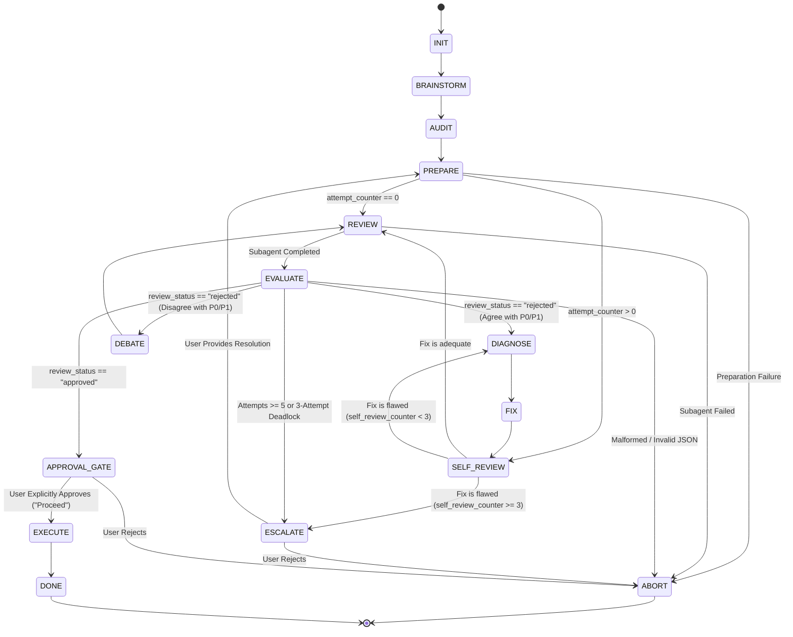

# Plan-Review Protocol



### State: INIT
**Action:**
- Initialize `attempt_counter = 0`, `conversation_id = null`, `self_review_counter = 0`, and `debate_counter = 0`.

**Transitions:**
- -> Transition to `BRAINSTORM`

### State: BRAINSTORM (Step 1: Set Clear Goals)
**Action:**
- Connect with `superpowers:brainstorming`.
- Explore user intent, uncover constraints, evaluate architectural trade-offs, and clarify requirements before drafting any plan.
- Ensure the problem domain and architectural objectives are rigorously understood before writing specifications.

**Transitions:**
- -> Transition to `AUDIT`

### State: AUDIT (Step 2: Identify Problems & Blast Radius)
**Action:**
- Self-activate the `superpowers` skill.
- Autonomously evaluate the architectural blast radius, edge cases, data structures, and concurrency implications.
- Identify potential breaking changes or integration friction across the workspace.

**Transitions:**
- -> Transition to `PREPARE`

### State: ABORT
**Action:**
- Halt execution. Any partially written `implementation_plan.md` is retained for manual inspection.
- Terminate any running peer reviewer subagents using `manage_subagents`.
- Release resources and notify the caller.

**Transitions:**
- -> [Terminal State]

### State: PREPARE (Step 4: Design Plans)
**Action:**
- Write the technical specification to `implementation_plan.md` in the project root directory.
- **Strict Format Standardization**: Adhere strictly to the format defined in `superpowers:writing-plans`:
  - Standard plan header:
    ```markdown
    # [Feature Name] Implementation Plan

    > **For agentic workers:** REQUIRED SUB-SKILL: Use superpowers:subagent-driven-development (recommended) or superpowers:executing-plans to implement this plan task-by-task. Steps use checkbox (`- [ ]`) syntax for tracking.

    **Goal:** [One sentence describing what this builds]
    **Architecture:** [2-3 sentences about approach]
    **Tech Stack:** [Key technologies/libraries]
    ```
  - Task right-sizing: 2–5 minute bite-sized tasks (`- [ ] Step 1: ...`, etc.).
  - Exact file paths (`Create: exact/path`, `Modify: exact/path:line`, `Test: exact/path`).
  - Explicit interface contracts (Consumes / Produces).
  - Explicit test commands and expected outputs (`Run: rtk pytest ...`, `Expected: PASS`).
  - Concrete code snippets for minimal implementation (zero placeholders, no "TODO", no "TBD").

**Transitions:**
- On failure -> Transition to `ABORT`
- On success and `attempt_counter == 0` -> Transition to `REVIEW`
- On success and `attempt_counter > 0` -> Transition to `SELF_REVIEW`

### State: SELF_REVIEW
**Action:**
- You are acting as a Pre-Reviewer.
- Read the contents of `implementation_plan.md`. Evaluate if the plan revisions address prior findings without regressions.
- Compare the changes against the P0/P1 issues that the Peer Reviewer raised in the previous iteration.
- Increment `self_review_counter`.

**Transitions:**
- If the fix is adequate -> Transition to `REVIEW` (submit to Peer Reviewer)
- If the fix is flawed or incomplete and `self_review_counter < 3` -> Transition to `DIAGNOSE`
- If the fix is flawed or incomplete and `self_review_counter >= 3` -> Transition to `ESCALATE`

### State: REVIEW
**Action:**
- Increment your internal `attempt_counter`.
- For Attempt 1: Use `invoke_subagent` with `Model: pro` (Opus) to spawn a Peer Reviewer subagent. Pass `implementation_plan.md` and instructions to evaluate it against the `superpowers` rule and return a structured JSON subagent payload:
  ```json
  {
    "status": "completed",
    "review_status": "approved|rejected",
    "summary": "Concise summary of review findings",
    "issues": [
      {
        "severity": "P0|P1|P2",
        "description": "Clear explanation of the architectural or functional flaw"
      }
    ]
  }
  ```
- For Attempts 2+: Use `send_message` to communicate revisions or rebuttals to the existing Peer Reviewer subagent (using its `conversation_id`).
- Set a liveness timer via `schedule` with `TimerCondition: any` per `rules/agent-delegation.md`.
- Save the subagent's `conversation_id` for subsequent turns.
- Save the full JSON response to `review.json` in the project root directory.

**Transitions:**
- If subagent returns `status == "failed"` -> Transition to `ABORT`
- If subagent returns `status == "completed"` -> Transition to `EVALUATE`

### State: EVALUATE (Step 2: Don't Tolerate Problems)
**Action:**
- Parse and analyze the structured JSON output from `review.json`:
  - P2 issues are non-blocking advisory feedback.
  - P0 issues are critical architectural flaws or security defects.
  - P1 issues are functional bugs, missing requirements, or unhandled edge cases.
- Apply Ray Dalio's Principle: **Don't Tolerate Problems**. Never sweep P0/P1 issues under the rug or relegate them to a backlog. P0 issues must be resolved before proceeding.
- If the outcome is to fix, reset `self_review_counter = 0` and `debate_counter = 0`.

**Transitions:**
- Priority 1: If `review_status == "approved"` and no P0/P1 issues exist -> Transition to `APPROVAL_GATE`
- Priority 2: If `review_status == "rejected"` and `attempt_counter >= 5` -> Transition to `ESCALATE`
- Priority 2: If `review_status == "rejected"` and `debate_counter >= 3` on the same issue -> Transition to `ESCALATE`
- Priority 3: If (`review_status == "rejected"` or P0/P1 issues exist) and you agree with the P0/P1 issues -> Transition to `DIAGNOSE`
- Priority 3: If (`review_status == "rejected"` or P0/P1 issues exist) and you disagree (e.g. out of scope, incorrect, violates requirements) -> Transition to `DEBATE`
- Fail-closed: If `review.json` is missing, malformed, or invalid -> Transition to `ABORT`

### State: DIAGNOSE (Step 3: Diagnose Root Causes)
**Action:**
- Connect with `superpowers:systematic-debugging`.
- Apply the Iron Law: **NO FIXES WITHOUT ROOT CAUSE INVESTIGATION FIRST**.
- Diagnose why the plan triggered peer review rejection before modifying any plan text.
- Do not make superficial patches or symptom fixes. Identify the structural root cause (e.g., missed dependency, flawed architectural assumption, incorrect interface boundary).
- Formulate a clear hypothesis and identify the exact structural changes needed.

**Transitions:**
- -> Transition to `FIX`

### State: FIX
**Action:**
- Modify `implementation_plan.md` in-place according to the diagnosed root cause.
- Overwrite `implementation_plan.md` with the updated bite-sized tasks, precise test commands, and interface definitions.

**Transitions:**
- -> Transition to `SELF_REVIEW`

### State: DEBATE
**Action:**
- Do not change the plan text. Formulate a technical rebuttal explaining why the issue is invalid, factually inaccurate, or out of scope.
- Increment `debate_counter`.

**Transitions:**
- -> Transition to `REVIEW` (pass the rebuttal using `send_message`)

### State: ESCALATE (Don't Tolerate Problems - Explicit Human Escalation)
**Action:**
- The review is deadlocked or has reached the 5-attempt limit.
- **Never bypass blockers**: Do NOT relegate P0/P1 blockers to technical debt backlogs or any bypass mechanism.
- P0 blockers represent critical architectural defects that MUST halt execution and require explicit human resolution.
- STOP execution and present the exact dispute and trade-offs to the human user for decision.

**Transitions:**
- Wait for user input:
  - If User provides resolution or architectural guidance -> Incorporate user decision into plan and Transition to `PREPARE`
  - If User Rejects -> Transition to `ABORT`

### State: APPROVAL_GATE (Step 5: Push to Results / Execution Gate)
**Action:**
- Plan is approved by Peer Review (`review_status == "approved"`).
- **Enforce Explicit Approval**: Per `rules/explicit-approval.md` and `rules/reasoning-quality.md`, NEVER automatically execute the plan.
- Present `implementation_plan.md` to the user and request explicit confirmation to execute:
  "Plan approved by peer review. Would you like me to proceed with execution using superpowers:subagent-driven-development?"
- Stop your turn and wait for the user to explicitly greenlight execution ("Proceed", "Execute", or user confirmation).

**Transitions:**
- If User Approves -> Transition to `EXECUTE`
- If User Rejects or requests changes -> Transition to `ABORT` (or `BRAINSTORM`/`PREPARE`)

### State: EXECUTE (Step 5: Push to Results via Subagents)
**Action:**
- Retain `implementation_plan.md` and `review.json`.
- Delegate execution to `superpowers:subagent-driven-development`.
- Dispatch fresh subagents per task, conduct task-level reviews, and push through each bite-sized step with continuous verification.

**Transitions:**
- -> Transition to `DONE`

### State: DONE
**Action:**
- Terminate any running peer reviewer subagents using `manage_subagents`.
- Preserve `implementation_plan.md`, `review.json`, and verification records.
- Compile final Architecture Decision Record in `docs/adr/` if applicable.

**Transitions:**
- -> [Terminal State]
