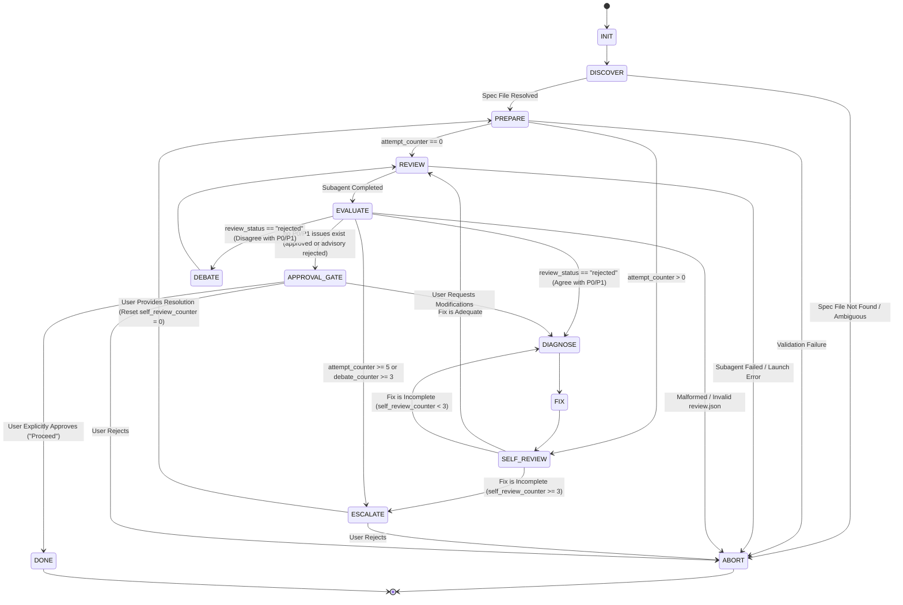

# Spec-Review Protocol

The `spec-review` skill conducts an adversarial architectural peer review of a design specification document before any implementation plan is drafted. It operationalizes Ray Dalio's 5-Step Process and Superpowers engineering principles to enforce immutable boundaries, complete schema definitions, failure mode analysis, and zero placeholders.

## Alignment with Core Principles

- **Step 1: Set Clear Goals**: Connects with `superpowers:brainstorming`. Architectural specifications capture WHAT and WHY per `rules/spec-standard.md`, without premature task sequencing or implementation checklists.
- **Step 2: Identify and Don't Tolerate Problems**: Independent peer review loops attack specifications. P0/P1 defects are blockers. Bypassing issues is strictly prohibited (no backlog relegation).
- **Step 3: Diagnose Root Causes**: Connects with `superpowers:systematic-debugging`. When review rejects a document, the agent investigates structural root causes before proposing modifications.
- **Step 4: Design Plans**: Once the specification is approved, transitions cleanly to `superpowers:writing-plans`.
- **Step 5: Push to Results**: Hard approval gates per `rules/explicit-approval.md`.



## Detailed State Specifications

### State: INIT
**Action:**
- Initialize in-memory loop state:
  `attempt_counter = 0`
  `debate_counter = 0`
  `self_review_counter = 0`
  `session_id = null`
  `resolved_spec_path = null`

**Transitions:**
- -> Transition to `DISCOVER`

### State: DISCOVER
**Action:**
- Resolve target specification using the Spec Resolution Hierarchy:
  1. **Priority 1 (Explicit Argument)**: If caller passes `$1`, resolve canonical path via `os.path.realpath`. If file does not exist, abort.
  2. **Priority 2 (Active Git Working Tree)**: Execute `rtk git status --porcelain docs/superpowers/specs/`. If exactly one spec file is modified (`M`), staged (`A`), or untracked (`??`), select it.
  3. **Priority 3 (Latest Timestamp File)**: Scan `docs/superpowers/specs/*.md` sorted by `mtime` descending. Select newest file if unambiguous.
  4. **Priority 4 (Interactive Disambiguation)**: If ambiguous, ask user to select. Never guess.

**Transitions:**
- If spec file resolved -> Transition to `PREPARE`
- If spec file not found or ambiguous -> Transition to `ABORT`

### State: PREPARE
**Action:**
- Pre-flight format validation. Read target spec file and verify structural integrity per `rules/spec-standard.md`:
  1. Title header `# [Topic] Specification` or `# [Topic] Design` or `# [Topic] Architecture`
  2. Required metadata: `Date`, `Status`, `Authors`
  3. Required sections: `Context & Motivation`, `Architecture & System Model`, `Component & Interface Contracts`, `Error Handling & Failure Modes`, `Verification & Testing`
  4. Absence of implementation checkboxes (`- [ ]`) or task execution steps
  5. Zero placeholders: Scan for `TODO`, `TBD`, `WIP`, or ellipsis (`...`) in place of logic
  6. External Contracts vs Internal Mechanisms: External schemas (DDL, JSON/YAML, OpenAPI), normative requirements (`REQ-xxx` <-> `AC-xxx`), and invariants are authoritative; internal implementation code or helper scripts (> 5 lines) are strictly prohibited.
- Upon entering from `ESCALATE`, ensure `self_review_counter = 0` is reset.

**Transitions:**
- If pre-flight validation fails -> Transition to `ABORT`
- If valid and `attempt_counter == 0` -> Transition to `REVIEW`
- If valid and `attempt_counter > 0` -> Transition to `SELF_REVIEW`

### State: SELF_REVIEW
**Action:**
- Pre-review inspection of spec revisions.
- Compare current spec against prior P0/P1 findings in `review.json`. Verify root-cause remediation without introducing collateral omissions.
- Increment `self_review_counter`.

**Transitions:**
- If fix is adequate -> Transition to `REVIEW`
- If fix is flawed and `self_review_counter < 3` -> Transition to `DIAGNOSE`
- If fix is flawed and `self_review_counter >= 3` -> Transition to `ESCALATE`

### State: REVIEW
**Action:**
- Increment `attempt_counter`.
- Turn 1: Dispatch Peer Reviewer subagent using:
  `rtk python3 scripts/peer_review.py --mode spec --target <SPEC_PATH> --repo . --output-file review.json`
  Reviewer evaluates spec criteria using the 8-Question Build-Ready Check (`rules/spec-standard.md`) and outputs structured payload to `review.json`:
  ```json
  {
    "status": "completed",
    "review_status": "approved|rejected",
    "summary": "Summary of spec review findings",
    "issues": [
      {
        "severity": "P0|P1|P2",
        "description": "Clear explanation of architectural or contract defect"
      }
    ]
  }
  ```
- Turns 2+: Resume reviewer session via `--session-id <session_id>` and `--message <rebuttal_or_fix_summary>`.
- Arm liveness timer via `schedule` tool (`TimerCondition: any`, `DurationSeconds: 300`) per `attention-guard/rules/AGENTS.md`.
- Save subagent `conversation_id` and output `review.json`.

**Transitions:**
- If reviewer process fails or returns code 2 -> Transition to `ABORT`
- If reviewer completes and yields valid `review.json` -> Transition to `EVALUATE`

### State: EVALUATE (Step 2: Don't Tolerate Problems)
**Action:**
- Inspect `review.json`:
  - P0: Critical architectural flaw, security hole, data loss risk, or broken contract (Blocks).
  - P1: Functional omission, unhandled failure mode, missing schema, or ambiguity (Blocks).
  - P2: Advisory suggestion, documentation formatting, stylistic improvement (Non-blocking).
- Apply Ray Dalio's Principle: **Don't Tolerate Problems**. Never downgrade P0/P1 to P2 or defer to backlog.
- **P2-Only Guard**: If `review_status == "rejected"` but issues array contains only P2 severity, treat as approved advisory and transition to `APPROVAL_GATE`.

**Transitions:**
- Priority 1: If `review_status == "approved"` and no P0/P1 issues exist -> Transition to `APPROVAL_GATE`
- Priority 1 (P2-Only Guard): If `review_status == "rejected"` but no P0/P1 issues exist -> Transition to `APPROVAL_GATE`
- Priority 2: If `attempt_counter >= 5` or `debate_counter >= 3` -> Transition to `ESCALATE`
- Priority 3: If P0/P1 issues exist and author agrees with findings -> Transition to `DIAGNOSE`
- Priority 3: If P0/P1 issues exist and author disagrees with findings -> Transition to `DEBATE`
- Fail-closed: If `review.json` is missing or malformed -> Transition to `ABORT`

### State: DIAGNOSE (Step 3: Diagnose Root Causes)
**Action:**
- Connect with `superpowers:systematic-debugging`.
- Diagnose structural root causes behind peer reviewer rejection. Document why architectural model permitted vulnerability or omission per `rules/spec-standard.md`. Controlled Spec Amendments: if requirements are discovered to be impossible, escalate to user for explicit re-approval.

**Transitions:**
- -> Transition to `FIX`

### State: FIX
**Action:**
- Modify specification document directly on disk to remedy root cause.
- Reset `debate_counter = 0`.

**Transitions:**
- -> Transition to `SELF_REVIEW`

### State: DEBATE
**Action:**
- Do not edit specification. Draft concrete technical rebuttal with citations to existing repo code, ADRs, or architectural constraints.
- Increment `debate_counter`.

**Transitions:**
- -> Transition to `REVIEW` (pass rebuttal via `--message`)

### State: ESCALATE (Don't Tolerate Problems - Explicit Human Escalation)
**Action:**
- Review reached attempt limit (`attempt_counter >= 5` or `debate_counter >= 3`).
- Stop autonomous looping. Present deadlock dispute, reviewer findings, and proposed alternatives to human user.

**Transitions:**
- If user provides decision or guidance -> Incorporate guidance, reset `self_review_counter = 0`, and Transition to `PREPARE`
- If user rejects design -> Transition to `ABORT`

### State: APPROVAL_GATE (Step 5: Explicit Approval Gate)
**Action:**
- Hard gate per `rules/explicit-approval.md`. Present approved specification to user:
  `"Specification approved by peer review. Target: <spec_path>. Proceed to implementation planning?"`
  Wait for explicit user confirmation.

**Transitions:**
- If user confirms ("Proceed", "Approved") -> Transition to `DONE`
- If user requests modifications -> Transition to `DIAGNOSE`
- If user rejects -> Transition to `ABORT`

### State: DONE
**Action:**
- Stage and commit validated specification to git:
  `rtk git add <spec_path> && rtk git commit -m "docs(spec): add approved specification for <topic>"`
- Save final `review.json` metadata.
- Transition cleanly to `superpowers:writing-plans`.

**Transitions:**
- -> Terminal State `[*]`.

### State: ABORT
**Action:**
- Terminate review workflow. Clean up temporary resources and report diagnostic cause to user.

**Transitions:**
- -> Terminal State `[*]`.
