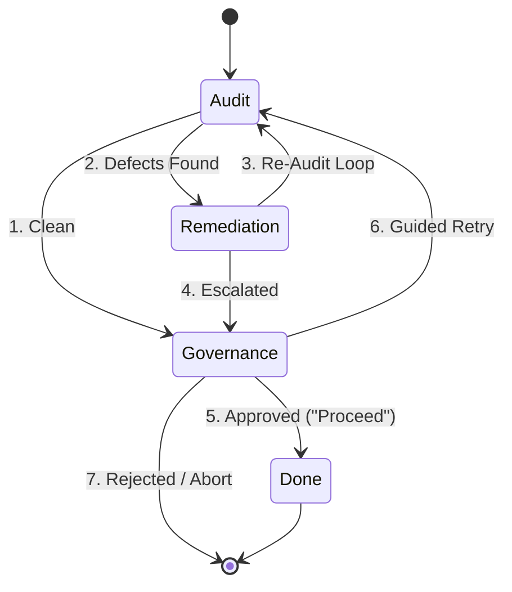

# Spec-Review Protocol

The `spec-review` skill conducts an adversarial architectural peer review of a design specification document before any implementation plan is drafted. It operationalizes Ray Dalio's 5-Step Process using the **Modular Review Architecture** (`docs/superpowers/specs/2026-09-16-modular-review-flows/`).

## Superpowers & Dalio 5-Step Integration
- **Step 1: Set Clear Goals:** Verify specification requirements against user intent established in `superpowers:brainstorming`.
- **Step 2: Don't Tolerate Problems:** Rigorously identify structural flaws. Zero tolerance for deferred defect backlogs; resolve all issues directly.
- **Step 3: Root Cause Diagnosis:** Isolate root causes using `superpowers:systematic-debugging` and `attention-guard/rules/AGENTS.md`.
- **Step 4: Deterministic Design:** Formalize verifiable specifications ready for planning in `superpowers:writing-plans`.
- **Step 5: Execution Accountability:** Human authorization gate governed by `rules/explicit-approval.md`.



## Review Execution Lifecycle

### Audit (Read-Only)
1. **Discover Target:** Resolve target `spec.md` using the resolution hierarchy:
   - Explicit argument: `$1` if provided.
   - Active package: `docs/superpowers/specs/<feature-id>/spec.md`.
   - Fallback: Scan recursively across `docs/superpowers/specs/**/spec.md` and `docs/superpowers/specs/*.md` (excluding `INDEX.md`) sorted by `mtime` descending.
2. **Execute Audit:** Launch an isolated review subagent via `peer_review.py`:
   ```bash
   python3 scripts/peer_review.py --target <resolved_spec> --mode spec --repo <repo_root> --output-file review.json [--prior-review <path>]
   ```
3. **Evaluate Verdict:**
   - **`1. Clean`** (No P0/P1 issues): Transition directly to **Governance**.
   - **`2. Defects Found`** (P0 or P1 issues present): Transition to **Remediation**.
   - **P2-Only Guard:** Advisory findings (P2/P3) do NOT block progression to Governance.
   - **System Error:** Escalate failure immediately. Subagents report structured JSON with `review_status` ("approved" or "rejected").

### Remediation
1. **Issue Triage:** Review each P0/P1 issue. Distinguish accepted defects (`1a`) from disputed feedback (`1b`).
2. **Root Cause Diagnosis (Dalio Step 3):**
   - Dispatch Tier 1 Read-Only Pro Diagnostician (`attention-guard/rules/AGENTS.md`) to isolate root causes with `superpowers:systematic-debugging`.
   - If second failure or ambiguous, dispatch Tier 2 External Second-Opinion (WorkBuddy or Codex).
3. **Stateless Rebuttal Protocol:**
   - For disputed findings, append evidence-backed technical rationale to the prior review context.
   - Do NOT run multi-turn debate loops; inject rebuttal directly into `--prior-review`.
4. **Escalation Ceiling:**
   - If `escalation_counter < 3`: Apply document amendment and transition back to **Audit** (`3. Re-Audit Loop`) with `--prior-review`.
   - If `escalation_counter >= 3`: Stop autonomous loops and transition directly to **Governance** (`4. Escalated`).

### Governance
1. **Human Gate Presentation:** Present the review verdict and findings dashboard to the user.
2. **User Authorization Gate (`rules/explicit-approval.md`):** Await explicit user action:
   - **`5. Approved` ("Proceed"):** Authorize proceeding to planning (`superpowers:writing-plans`).
   - **`6. Guided Retry`:** User provides direction; reset `escalation_counter = 0`.
   - **`7. Rejected`:** User rejects specification.
3. **Audit Ledger Persistence:**
   - Archive the review record to `docs/superpowers/specs/<feature-id>/reviews/spec-v<N>.json`.
   - Update feature status and review link in `docs/superpowers/specs/INDEX.md`.
