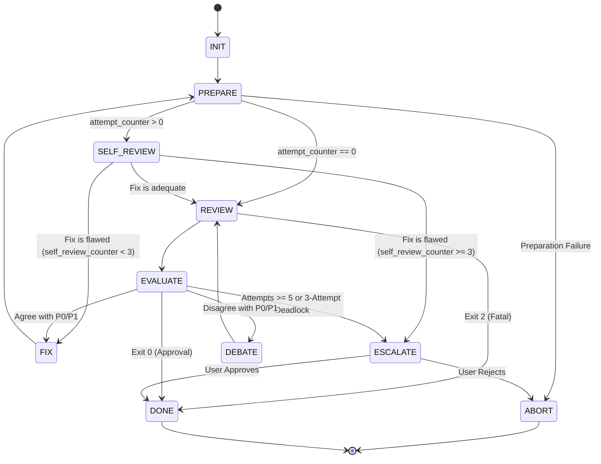

# Tribunal Protocol

### State: INIT
**Action:**
- Initialize `attempt_counter = 0`, `session_id = null`, and `self_review_counter = 0`.

**Transitions:**
- -> Transition to `PREPARE`

### State: ABORT
**Action:**
- Halt execution. Any partially written `<PLAN_FILE>` is retained for manual inspection.

**Transitions:**
- -> [Terminal State]

### State: PREPARE
**Action:**
- Write the technical specification to `docs/adr/YYYYMMDD_HHMM_implementation_plan_rev<N>.md`.

**Transitions:**
- On failure -> Transition to `ABORT`
- On success and `attempt_counter == 0` -> Transition to `REVIEW`
- On success and `attempt_counter > 0` -> Transition to `SELF_REVIEW`

### State: SELF_REVIEW
**Action:**
- You are acting as a Pre-Reviewer.
- Read the contents of the `<PLAN_FILE>` file. Evaluate if the plan revisions address prior findings without regressions.
- Compare the changes against the P0/P1 issues that Codex raised in the previous iteration.
- Increment the `self_review_counter`.

**Transitions:**
- If the fix is adequate -> Transition to `REVIEW` (to submit to Codex)
- If the fix is flawed or incomplete and `self_review_counter < 3` -> Transition to `FIX` (to modify again)
- If the fix is flawed or incomplete and `self_review_counter >= 3` -> Transition to `ESCALATE`

### State: REVIEW
**Action:**
- Increment your internal attempt counter.
- Run the peer review script:
  - For Attempt 1:
    `python3 ~/.gemini/config/plugins/ai-review-plugin/scripts/peer_review.py --mode plan --target "$(pwd)/docs/adr/YYYYMMDD_HHMM_implementation_plan_rev<N>.md" --repo .`
  - For Attempts 2+: Substitute `<SESSION_ID>` literally using the stored ID.
    `python3 ~/.gemini/config/plugins/ai-review-plugin/scripts/peer_review.py --mode plan --target "$(pwd)/docs/adr/YYYYMMDD_HHMM_implementation_plan_rev<N>.md" --repo . --session-id "<SESSION_ID>" [--message "<MESSAGE>"]`
- Check for Exit 2 (Fatal) before attempting to parse the JSON output.
- Parse the JSON output, extract and save the `session_id` for subsequent attempts.
- Save the full JSON to `docs/adr/<timestamp>_review_rev<N>.json`.

**Transitions:**
- If Exit 2 (Fatal) -> Transition to `DONE`
- Else -> Transition to `EVALUATE`

### State: EVALUATE
**Action:**
- Analyze the JSON output. 
- P2 issues are non-blocking advisory feedback.
- Evaluate guards in priority order.
- If the outcome is to fix, reset `self_review_counter = 0`.

**Transitions:**
- Priority 1: If Exit 0 (Approved) -> Transition to `DONE`
- Priority 2: If Exit 1 (Rejected) and attempt counter >= 5 -> Transition to `ESCALATE`
- Priority 2: If Exit 1 (Rejected) and Codex has refused your rebuttal 3 times on the same issue -> Transition to `ESCALATE`
- Priority 3: If Exit 1 (Rejected) and you agree with the P0/P1 issues -> Transition to `FIX`
- Priority 3: If Exit 1 (Rejected) and you disagree (e.g. out of scope, incorrect) -> Transition to `DEBATE`

### State: FIX
**Action:**
- Modify the implementation plan `.md` file. Do not delete the old plan, overwrite the same file.

**Transitions:**
- -> Transition to `PREPARE`

### State: DEBATE
**Action:**
- Do not change the code/plan. Formulate a technical rebuttal explaining why the issue is invalid or out of scope.

**Transitions:**
- -> Transition to `REVIEW` (pass the rebuttal using the `--message` argument and include `--session-id`)

### State: ESCALATE
**Action:**
- The review is deadlocked or has exceeded the attempt limit.
- STOP execution and request explicit User approval. Do not report findings as tech debt unless the user approves.

**Transitions:**
- Wait for user input.
  - If User Approves -> Write a markdown file explaining the dispute to `docs/tech_debt/<issue_name>.md`, then Transition to `DONE`
  - If User Rejects -> Transition to `ABORT`

### State: DONE
**Action:**
- If Approved (Exit 0): Do NOT delete `<PLAN_FILE>`, generate `consensus_summary.md`, and automatically execute the approved plan.
- If Fatal (Exit 2) or User Rejects: Do NOT delete `<PLAN_FILE>`, stop execution, and do NOT execute the plan.

**Transitions:**
- -> [Terminal State]
